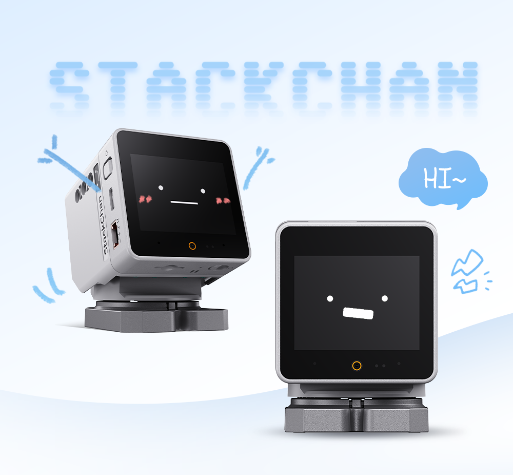
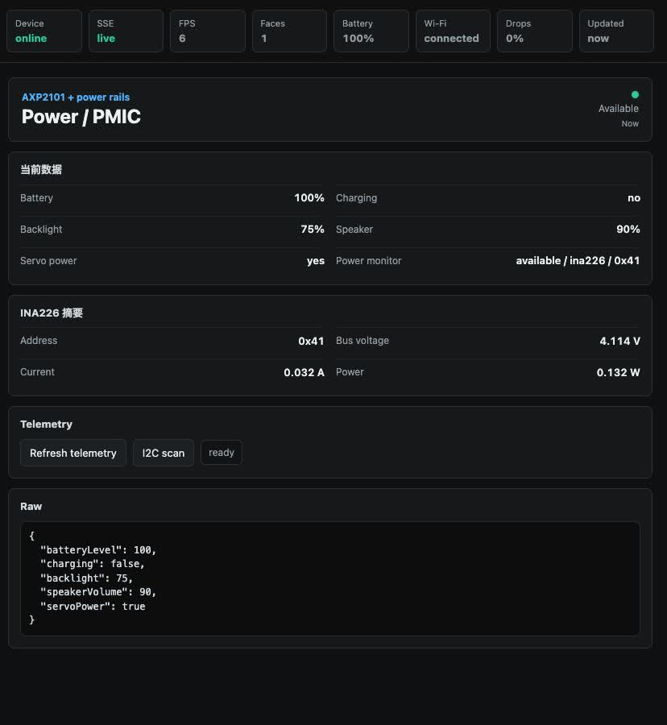
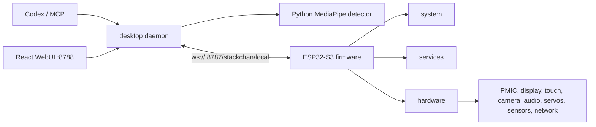
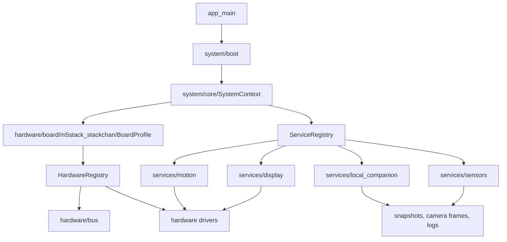
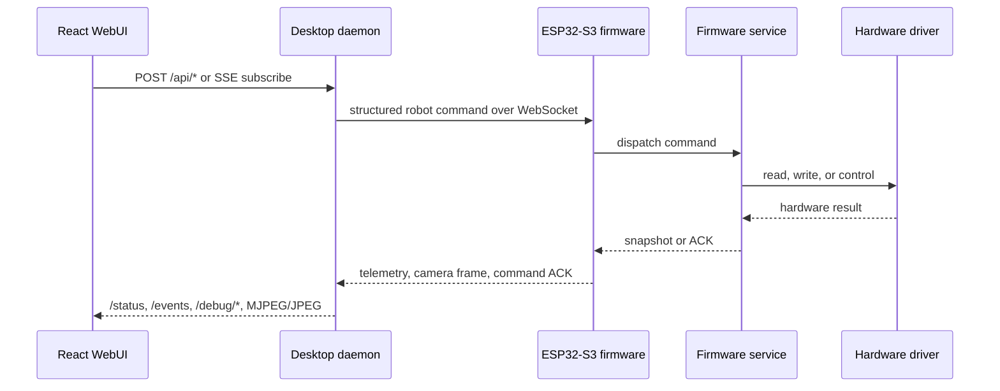

# StackChan Local

[English](README.md) | [Chinese](README_zh.md)

<p align="center">
  
  
  
  
  
  
</p>

StackChan Local is a local-first desktop daemon and ESP-IDF firmware for M5Stack StackChan on ESP32-S3. The hardware connects to a Mac on the LAN over WebSocket, while Codex, the browser console, and optional local vision services run on the desktop.

The current architecture has three explicit firmware layers:

- `hardware`: board profile, buses, chip drivers, and device-facing IO.
- `services`: hardware application behavior such as display, motion, sensors, power, audio, network, and local companion protocol handling.
- `system`: boot, lifecycle, settings, diagnostics, runtime bridge, and ESP-IDF platform adapters.

The old `firmware/main/vendor/embedded_runtime` path is no longer part of the project. Passive third-party chip libraries live in `firmware/main/third_party`; runtime behavior is owned by `hardware`, `services`, and `system`.

## Visual Overview

| Hardware target | Local hardware console |
| --- | --- |
|  |  |
| M5Stack StackChan on ESP32-S3 with GC0308 camera, touch, IMU, servos, RGB, audio, and power modules. | React + Vite console for modules, applications, raw snapshots, logs, and camera streams. |

## Project Snapshot

| Dimension | Current design |
| --- | --- |
| Hardware target | M5Stack StackChan / ESP32-S3 only |
| Firmware stack | ESP-IDF 5.5.4 with `system`, `hardware`, and `services` layers |
| Desktop stack | TypeScript daemon, React + Vite WebUI, local Python vision sidecar |
| Transport | LAN WebSocket at `ws://<mac-ip>:8787/stackchan/local` plus HTTP/SSE/MJPEG on `8788` |
| Control model | Structured safe commands; no raw JSON command console |
| Vision model | Local face-position detection only; no identity or expression recognition |
| Hardware observability | Per-module pages, public snapshot, logs, I2C scan, stream metrics, and sensor availability reasons |

## Contents

- [What It Does](#what-it-does)
- [Repository Layout](#repository-layout)
- [Architecture](#architecture)
- [Runtime Endpoints](#runtime-endpoints)
- [Firmware Layering](#firmware-layering)
- [WebUI](#webui)
- [Capability Matrix](#capability-matrix)
- [Quick Start](#quick-start)
- [Development Commands](#development-commands)
- [Testing](#testing)

## What It Does

- Runs StackChan as a local Codex companion without the original cloud server or mobile app runtime.
- Mirrors Codex activity into hardware states such as idle, thinking, and speaking.
- Plays optional Codex completion TTS and RGB light alerts.
- Streams camera frames to the desktop for local face-position tracking.
- Exposes a componentized React console at `http://localhost:8788`.
- Reports hardware telemetry for power, touch, IMU, magnetometer, camera, servos, audio, RTC, NFC, IR, LTR553, INA226, Wi-Fi, BLE, RGB, and IO expander state.
- Provides MCP tools so Codex can query status, speak, move the head, capture images, set modes, and control face tracking.

Face tracking is position tracking only. It does not perform identity recognition, and expression recognition UI/runtime has been removed.

## Repository Layout

```text
.
├── assets/              README assets
├── desktop/             TypeScript daemon, WebSocket server, MCP server, vision, TTS, WebUI server
│   ├── src/
│   │   ├── codex/       Codex session watcher
│   │   ├── device/      Device registry and snapshots
│   │   ├── mcp/         MCP tool server
│   │   ├── preview/     8788 HTTP/SSE/MJPEG/API server
│   │   ├── robot/       Command controller and motion arbitration
│   │   ├── tts/         Completion announcer and provider integration
│   │   ├── vision/      Face detector sidecar and tracking controller
│   │   └── ws/          Firmware WebSocket protocol server
│   └── preview-ui/      React + Vite hardware console
├── firmware/            ESP-IDF firmware project for M5Stack StackChan / ESP32-S3
│   └── main/
│       ├── hardware/    Board profile, bus, driver, and sensor modules
│       ├── services/    Display, sensors, motion, audio, power, network, local companion
│       ├── system/      Boot, core context, lifecycle, runtime bridge, ESP-IDF adapters
│       ├── third_party/ Passive chip libraries
│       └── app/         Local Companion UI entry
├── protocol/            Shared TypeScript protocol types and JSON schema validation
└── scripts/             Build, flash, and hygiene scripts
```

## Architecture

### Runtime Topology



### Firmware Ownership



### Command And Telemetry Loop



### Desktop Responsibilities

- Listen for firmware WebSocket connections on `8787`.
- Validate protocol messages with shared schemas from `protocol/`.
- Maintain device sessions, heartbeat state, command ACKs, and public snapshots.
- Expose the React WebUI, status APIs, debug logs, SSE updates, and raw/processed camera streams on `8788`.
- Run MCP tools for Codex.
- Watch Codex session state and dispatch companion mode changes.
- Run optional completion TTS and RGB light alerts.
- Run local face-position tracking through `desktop/scripts/face_detector.py`.

### Firmware Responsibilities

- Boot the M5Stack StackChan board profile and initialize hardware drivers.
- Compose drivers into services for display, motion, sensors, power, audio, network, and local companion transport.
- Connect to the desktop daemon using mDNS or saved fallback WebSocket URL.
- Send heartbeat, state, sensor snapshots, touch, IMU, battery, Wi-Fi, camera, and audio telemetry.
- Execute commands for mode, audio playback, camera stream, RGB, servo motion, face tracking, and telemetry configuration.
- Keep local avatar rendering, blinking, idle behavior, and power policy on-device.

## Runtime Endpoints

| Surface | Default | Owner | Purpose |
| --- | --- | --- | --- |
| Firmware WebSocket | `ws://<mac-ip>:8787/stackchan/local` | `desktop/src/ws` | Firmware session, heartbeat, telemetry, commands |
| Preview WebUI | `http://localhost:8788/` | `desktop/src/preview` + `desktop/preview-ui` | Browser console for modules, applications, and debug pages |
| Public status | `GET /status` | Preview server | Device/session summary consumed by the UI |
| Public snapshot | `GET /debug/snapshot` | Preview server | Raw public JSON snapshot for diagnostics |
| Logs | `GET /debug/logs`, `GET /debug/log-events` | Preview server | Daemon logs and streaming log updates |
| Camera streams | `GET /frame.jpg`, `GET /stream.mjpg` | Preview server | Latest raw/processed camera frames |
| Service discovery | `_stackchan-local._tcp` | Desktop daemon | mDNS discovery for firmware pairing |

## Firmware Layering

```text
firmware/main/
  hardware/
    board/m5stack_stackchan/   pinmap, hardware_config, BoardProfile
    bus/                       I2C device/bus helpers
    power/                     AXP2101 and backlight
    display/                   ILI9342/LVGL driver boundary
    touch/                     FT6336 screen touch
    audio/                     ES7210/AW88298/CoreS3 codec surface
    camera/                    GC0308 camera
    motion/                    SCS servo driver surface
    io_expander/               AW9523/PY32 IO expander
    lighting/                  RGB strip driver boundary
    sensors/                   SI12T, BMI270, BMM150, RTC, INA226, LTR553, NFC, IR, mic level
    network/                   Wi-Fi, BLE, provisioning helpers

  services/
    display/                   LVGL runtime, avatar binding, status display, RGB behavior
    sensors/                   Polling, snapshots, I2C diagnostics, sensor events
    motion/                    Servo calibration and expression-motion output
    power/                     Servo power and IO expander power policy
    audio/                     Codec service, wake word/audio runtime, mic level
    network/                   Wi-Fi, SNTP, BLE provisioning
    expression_motion/         Avatar, animation, modifiers, StackChan motion engine
    local_companion/           WebSocket session, command dispatch, telemetry, media streams

  system/
    boot/                      Startup sequence and runtime boot
    core/                      SystemContext, settings, event bus, service registry, diagnostics
    lifecycle/                 Reboot, power off, factory reset/runtime state
    power_policy/              Idle power policy namespace
    platform/esp_idf/          ESP-IDF adapters
    runtime_bridge/            Narrow compatibility bridge
    legacy_runtime/            Temporary compatibility primitives only

  third_party/                 Passive chip libraries only
```

Rules for new firmware code:

- `hardware` drivers take bus/config dependencies and expose `begin`, `available`, `read`, `write`, or `control` style APIs.
- `hardware` must not depend on LVGL app objects, Local Companion services, desktop protocol code, or `Board::GetInstance()`.
- `services` compose drivers and publish application-level behavior, telemetry, and events.
- `system` owns boot order, shared context, lifecycle, settings, diagnostics, and compatibility boundaries.
- Do not reintroduce `firmware/main/vendor/embedded_runtime` or expand runtime bridge usage for new code.

## WebUI

The WebUI is served by the desktop daemon at `http://localhost:8788`. It is a React + Vite app under `desktop/preview-ui/`.

The console has three groups:

- **Modules**: one page per chip or hardware module: Power, INA226, Display, Screen Touch, Head Touch, IMU, Magnetometer, Camera, Servo, IO Expander, RGB LED, RTC, ALS/Proximity, NFC, IR, Audio, Wi-Fi/BLE.
- **Applications**: Codex announcer/light alert and face-position tracking.
- **Debug**: system counters, raw public snapshot, and daemon logs.

Camera pages expose separate raw and processed streams:

- Raw preview: camera stream before face detection.
- Face tracking: processed stream with face-position overlay.

## Capability Matrix

| Group | Pages or services | Data shown | Safe commands |
| --- | --- | --- | --- |
| Power | AXP2101, INA226, backlight policy | Battery, charge state, rail current/power, availability reasons | Telemetry refresh, I2C scan |
| Touch and motion sensors | FT6336, SI12T, BMI270, BMM150, LTR553 | Touch state, accel/gyro, magnetometer, ALS/proximity | Telemetry refresh, I2C scan |
| Camera and vision | GC0308 raw stream, face-position processed stream | FPS, frame interval, latency, JPEG size, face target | Stream on/off, capture, FPS selection |
| Actuators | SCS servos, RGB LED, IO expander | Servo pose, limits, RGB state, expander pins | Move head, set RGB color/brightness, telemetry refresh |
| Audio and time | ES7210, AW88298, RTC | Mic level, codec status, RTC time | TTS/say through MCP, telemetry refresh |
| Network | Wi-Fi, BLE provisioning, mDNS | Link state, SSID/IP, RSSI, reconnect counters | Provisioning and runtime network commands through services |
| Applications | Codex announcer/light alert, face-position tracking | App state, enabled flags, tracking target and latency | Toggle tracking, adjust FPS, companion mode commands |
| Debug | System, raw snapshot, logs | Heap, counters, command ACKs, public JSON, daemon logs | Read-only diagnostics |

## Quick Start

### 1. Install Desktop Dependencies

```bash
npm install
cp .env.example .env
```

Edit `.env` before using real hardware. At minimum, change:

```bash
STACKCHAN_PAIRING_TOKEN=dev-local-token
```

### 2. Start Desktop Daemon

```bash
npm run dev
```

Default endpoints:

- Firmware WebSocket: `ws://<mac-ip>:8787/stackchan/local`
- WebUI: `http://localhost:8788`
- mDNS service: `_stackchan-local._tcp`

### 3. Optional Face Tracking Setup

```bash
npm run vision:install
npm run vision:model
STACKCHAN_FACE_TRACKING=1 npm run dev
```

Face tracking uses the local Python sidecar and fixed 320 x 240 camera input. The WebUI exposes FPS options for the active stream.

### 4. Build And Flash Firmware

Use ESP-IDF 5.5.4 for the current firmware tree:

```bash
source ~/esp/esp-idf-v5.5.4/export.sh
npm run firmware:build
npm run firmware:check-local-only
npm run firmware:flash
```

Equivalent raw ESP-IDF commands:

```bash
cd firmware
idf.py set-target esp32s3
idf.py build
idf.py -p /dev/cu.usbmodem21301 flash monitor
```

If the device has no saved Wi-Fi credentials, it starts a `StackChan-XXXX` provisioning AP. Connect to it and open `http://192.168.4.1`.

## Configuration

Common settings live in [.env.example](.env.example).

Important defaults:

- `STACKCHAN_LOCAL_PORT=8787`
- `STACKCHAN_PREVIEW_PORT=8788`
- `STACKCHAN_PAIRING_TOKEN=dev-local-token`
- `STACKCHAN_FACE_TRACKING=0`
- `STACKCHAN_FACE_TRACKING_CAMERA_PRESET=fast`
- `STACKCHAN_FACE_TRACKING_SPEED=620`
- `STACKCHAN_FACE_TRACKING_DEADBAND=0.025`
- `STACKCHAN_CODEX_STATUS=1`
- `STACKCHAN_VOLCENGINE_TTS_ENABLED=0`

Do not commit real pairing tokens or provider API keys.

## MCP Tools

Run MCP mode with:

```bash
npm run mcp
```

Available tools:

- `stackchan_status`
- `stackchan_say`
- `stackchan_react`
- `stackchan_move_head`
- `stackchan_play_animation`
- `stackchan_capture_image`
- `stackchan_set_mode`
- `stackchan_face_tracking`

## Development Commands

| Goal | Command |
| --- | --- |
| Install workspace dependencies | `npm install` |
| Start desktop daemon and WebUI | `npm run dev` |
| Run MCP server mode | `npm run mcp` |
| Type-check all TypeScript packages | `npm run typecheck` |
| Run protocol and desktop tests | `npm test` |
| Build preview UI and desktop TypeScript | `npm run build` |
| Install local vision dependencies | `npm run vision:install` |
| Download the face detector model | `npm run vision:model` |
| Build firmware | `source ~/esp/esp-idf-v5.5.4/export.sh && npm run firmware:build` |
| Flash firmware | `source ~/esp/esp-idf-v5.5.4/export.sh && npm run firmware:flash` |
| Check firmware local-only boundaries | `npm run firmware:check-local-only` |

## Testing

Desktop and protocol:

```bash
npm run typecheck
npm test
npm run check
```

Targeted checks:

```bash
npm test -w @stackchan-local/protocol
npm test -w @stackchan-local/desktop
npm run typecheck -w @stackchan-local/desktop
```

Firmware:

```bash
source ~/esp/esp-idf-v5.5.4/export.sh
npm run firmware:build
npm run firmware:check-local-only
```

Hardware acceptance after flashing:

- `http://localhost:8788/`, `/status`, `/debug/snapshot`, and `/debug/logs` return 200.
- Device shows online in the WebUI.
- Module pages update for PMIC/battery, touch, head touch, IMU, magnetometer, RTC, mic, camera, RGB/io expander, servos, I2C scan, NFC, IR, LTR553, and INA226.
- Present hardware reports valid non-NaN values and reacts to touch, motion, light, sound, and camera stimuli.
- Missing or unsupported modules report `available:false` with a clear reason.
- `/frame.jpg` or `/stream.mjpg` returns a valid JPEG stream when camera streaming is enabled.
- Firmware serial logs and desktop logs have no unexplained `ERROR`, no persistent `WARN` spam, no reconnect loop, and no repeated sensor init timeout.

## Privacy And Safety

- Camera frames stay on the LAN between the hardware and desktop daemon.
- Face tracking is local position detection only, not identity recognition.
- Expression recognition and expression-sync UI have been removed.
- Cloud TTS is optional and disabled by default.
- Pairing tokens and API keys belong in `.env`, not in Git.

## Project Status

This is an experimental local hardware/software project for macOS plus M5Stack StackChan on ESP32-S3. The current focus is hardware observability, stable local control, and a clean firmware layering model. Cross-platform desktop packaging and production-grade firmware release flow still need hardening.

## License

MIT for StackChan Local project code unless a subdirectory or managed dependency states otherwise.
