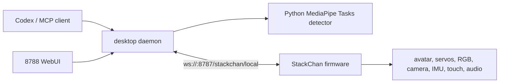

# StackChan Local

[English](README.md) | [中文](README_zh.md)

StackChan Local turns M5Stack StackChan into a local-first desktop robot for Codex.
It removes the runtime dependency on the original cloud server and mobile app path, then connects the hardware to a local TypeScript daemon over LAN WebSocket.

The project is intended for makers who want a physical Codex companion that can show `idle`, `thinking`, and `speaking` states, speak local task-completion messages, flash RGB lights, track faces with its camera, and expose live debugging data in a browser.

## Features

- **Local-only runtime**: desktop daemon and firmware communicate over your LAN; no cloud server is required for the core control loop.
- **Codex state companion**: mirrors Codex activity into StackChan states such as `idle`, `thinking`, and `speaking`.
- **Completion notifications**: optional task-completion TTS plus RGB light flash when a Codex task finishes.
- **Face tracking**: StackChan camera streams low-FPS JPEG frames to the desktop daemon; local MediaPipe Tasks Face Landmarker drives smooth head tracking with pose, landmarks, and expression hints.
- **Hardware dashboard**: `http://localhost:8788` shows camera preview, face boxes, PID tuning, sensors, device state, command status, and structured logs.
- **MCP tools**: Codex can control speech, emotion, head motion, animation, image capture, mode, and face tracking.
- **Firmware local companion mode**: boots directly into the StackChan face UI with local WebSocket control, idle motion, blinking, sensor events, and offline shutdown behavior.

## Screenshots

<p align="center">
  
</p>

<p align="center">
  <sub>Real local WebUI session. The camera preview is blurred for README privacy.</sub>
</p>

<table>
  <tr>
    <td width="58%">
      
    </td>
    <td width="42%">
      
    </td>
  </tr>
  <tr>
    <td align="center"><sub>Desktop dashboard layout</sub></td>
    <td align="center"><sub>Vertical mobile layout</sub></td>
  </tr>
</table>

## Repository Layout

```text
.
├── desktop/          TypeScript daemon, MCP server, WebUI, vision sidecar integration
├── firmware/         ESP-IDF firmware overlay for StackChan Local Companion
├── protocol/         Shared TypeScript types and JSON Schema validation
├── docs/             Architecture, setup, WebUI, firmware, protocol, troubleshooting
└── scripts/          Convenience scripts for desktop and firmware workflows
```

## Documentation

- [Setup](docs/setup.md)
- [Configuration](docs/configuration.md)
- [Architecture](docs/architecture.md)
- [WebUI](docs/web-ui.md)
- [Codex MCP](docs/codex-mcp.md)
- [Local Protocol](docs/protocol.md)
- [Firmware](docs/firmware.md)
- [Troubleshooting](docs/troubleshooting.md)

## Architecture



The desktop daemon owns protocol validation, device registry, command ACKs, motion arbitration, Codex session watching, face detection orchestration, TTS dispatch, and the 8788 dashboard. Firmware owns local UI rendering, camera capture, audio playback, wake word/audio chain, servos, RGB, sensors, and reconnection behavior.

## Quick Start

### 1. Install desktop dependencies

```bash
npm install
cp .env.example .env
```

Edit `.env` and set at least `STACKCHAN_PAIRING_TOKEN`.

### 2. Start the daemon

```bash
npm run dev
```

Default endpoints:

- Device WebSocket: `ws://<mac-ip>:8787/stackchan/local`
- WebUI dashboard: `http://localhost:8788`
- mDNS service advertised by desktop: `_stackchan-local._tcp`

### 3. Install vision dependencies, optional

Face tracking uses a local Python sidecar.

```bash
npm run vision:install
npm run vision:model
STACKCHAN_FACE_TRACKING=1 npm run dev
```

### 4. Build and flash firmware

```bash
source ~/esp/esp-idf-v5.5.4/export.sh
npm run firmware:build
npm run firmware:check-local-only
cd firmware
idf.py -p /dev/cu.usbmodem21301 flash
```

Equivalent raw ESP-IDF commands:

```bash
cd firmware
idf.py set-target esp32s3
idf.py build
idf.py flash monitor
```

The firmware first connects to saved Wi-Fi. If no credentials are saved, it starts a Wi-Fi configuration hotspot named `StackChan-XXXX`; connect to that hotspot and open `http://192.168.4.1`.

### Local-Only Firmware Build

The firmware tree keeps only the local companion app and device runtime surface in `firmware/main`. ESP-IDF Component Manager resolves standard dependencies into `firmware/managed_components/`: ArduinoJson comes from the ESP Component Registry, while Mooncake, Mooncake Log, and Smooth UI Toolkit are Git dependencies. The retained embedded runtime subset is checked into `firmware/main/embedded_runtime/`, so firmware builds no longer clone a separate upstream project during compilation.

CMake defines `STACKCHAN_LOCAL_DISABLE_LEGACY_CLOUD=1`, compiles out the camera explain HTTP path, links project-owned runtime compatibility code from `firmware/main/runtime_compat/`, and keeps the robot expression/motion engine in `firmware/main/robot_expression_motion_runtime/`. There is no legacy `firmware/main/hal` directory: the public facade is `firmware/main/system/device_runtime.h`, hardware drivers live beside their owning hardware or sensor module, and network transport shims remain under `firmware/main/local_runtime_adapters/network/`. The upstream cloud application, cloud MQTT/WebSocket protocol clients, OTA, 4G modem, ESP-NOW, and old StackChan app launcher sources are not part of the local runtime. Verify this boundary after every firmware build:

```bash
npm run firmware:check-local-only
```

## Configuration

Common environment variables are listed in [.env.example](.env.example).

Important defaults:

- `STACKCHAN_LOCAL_PORT=8787`
- `STACKCHAN_PREVIEW_PORT=8788`
- `STACKCHAN_PAIRING_TOKEN=dev-local-token`
- `STACKCHAN_FACE_TRACKING=0`
- `STACKCHAN_FACE_TRACKING_CAMERA_PRESET=fast`
- `STACKCHAN_CODEX_STATUS=1`
- `STACKCHAN_VOLCENGINE_TTS_ENABLED=0`

Do not commit real API keys or pairing tokens.

## WebUI

The WebUI is served by the daemon and is designed to work well on both desktop and vertical mobile screens.

Main panels:

- **Overview**: device status, face tracking state, latest target, capabilities.
- **Hardware**: battery, Wi-Fi, BLE, RTC, speaker, RGB, camera, servos, IMU, touch, and peripheral placeholders.
- **Tuning**: camera presets, PID controls, tracking presets, completion TTS volume, completion TTS toggle, completion light toggle.
- **Debug**: session id, firmware version, last event, counters, raw snapshot.
- **Logs**: daemon ring-buffer logs with level/type/search filters.

See [docs/web-ui.md](docs/web-ui.md) for API endpoints and UI details.

## MCP Tools

The desktop daemon exposes these tools in MCP mode:

- `stackchan_status`
- `stackchan_say`
- `stackchan_react`
- `stackchan_move_head`
- `stackchan_play_animation`
- `stackchan_capture_image`
- `stackchan_set_mode`
- `stackchan_face_tracking`

Run MCP mode with:

```bash
npm run mcp
```

See [docs/codex-mcp.md](docs/codex-mcp.md).

## Local Protocol

Firmware connects with a JSON handshake containing device id, firmware version, capabilities, audio params, and pairing token. After pairing, messages use JSON envelopes for `robot.command`, `robot.event`, `heartbeat`, and `error`.

See [docs/protocol.md](docs/protocol.md).

## Testing

```bash
npm run typecheck
npm test
```

Combined desktop/protocol check:

```bash
npm run check
```

Firmware build:

```bash
source ~/esp/esp-idf-v5.5.4/export.sh
npm run firmware:build
npm run firmware:check-local-only
```

Pre-publish hygiene check:

```bash
npm run open-source:check
```

## Privacy And Safety

- Face tracking is local detection only. It does not do identity recognition.
- Camera frames stay on the LAN between hardware and daemon.
- Microphone direction finding was intentionally removed; microphones remain for wake word and voice audio.
- Cloud TTS is optional and disabled by default. If enabled, only completion text is sent to the configured TTS provider.
- Pairing tokens and provider keys belong in `.env`, not in Git.

## Project Status

This is an experimental hardware/software project. The current target is macOS desktop plus M5Stack StackChan hardware. The architecture is already local-first, but firmware provisioning, release packaging, and cross-platform desktop support still need hardening.

## Credits

This project builds on:

- M5Stack StackChan firmware concepts and hardware
- retained ESP32 assistant runtime components
- ESP-IDF and ESP32 managed components
- MediaPipe Tasks Face Landmarker for local face tracking

Third-party source, Git dependencies, and generated ESP-IDF dependencies keep their own licenses.

## License

MIT for the StackChan Local project code unless a subdirectory or managed dependency states otherwise.
