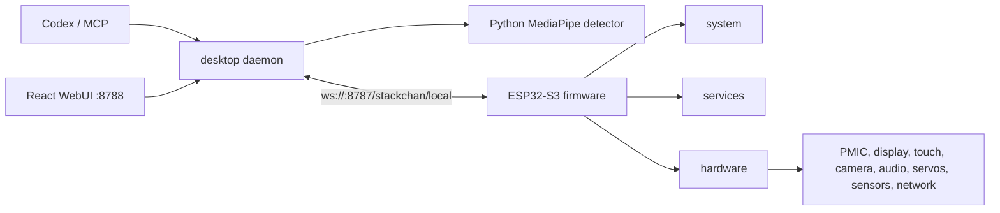

# StackChan Local

[English](README.md) | [中文](README_zh.md)

StackChan Local 是面向 M5Stack StackChan / ESP32-S3 的本地优先桌面 daemon 和 ESP-IDF 固件。硬件通过局域网 WebSocket 连接 Mac，Codex、浏览器控制台和可选的人脸检测服务运行在桌面端。

当前固件架构明确分为三层：

- `hardware`：板级配置、总线、芯片驱动和设备 IO。
- `services`：显示、运动、传感器、电源、音频、网络、本地 companion 协议等硬件应用编排。
- `system`：启动、生命周期、设置、诊断、运行时桥接和 ESP-IDF 平台适配。

旧的 `firmware/main/vendor/embedded_runtime` 已经不再属于项目结构。必要的纯第三方芯片库放在 `firmware/main/third_party`，运行时行为由 `hardware`、`services`、`system` 三层接管。

## 功能

- 让 StackChan 作为本地 Codex companion 运行，不依赖原始云端 server 或手机 App runtime。
- 把 Codex 状态同步到硬件的 idle、thinking、speaking 等模式。
- Codex 任务完成后可选 TTS 播报和 RGB 灯光提醒。
- 摄像头帧传到桌面端，由本地人脸位置检测驱动头部跟踪。
- 在 `http://localhost:8788` 暴露组件化 React 控制台。
- 实时展示电源、触摸、IMU、磁力计、摄像头、舵机、音频、RTC、NFC、IR、LTR553、INA226、Wi-Fi、BLE、RGB、IO expander 等硬件遥测。
- 提供 MCP 工具，让 Codex 查询状态、说话、移动头部、拍照、设置模式和控制人脸追踪。

人脸追踪只做位置跟踪，不做身份识别。表情识别相关运行时和 UI 已移除。

## 硬件示例


## UI 示例


## 目录结构

```text
.
├── assets/              README 图片资源
├── desktop/             TypeScript daemon、WebSocket server、MCP server、vision、TTS、WebUI server
│   ├── src/
│   │   ├── codex/       Codex session watcher
│   │   ├── device/      设备注册表和快照
│   │   ├── mcp/         MCP 工具 server
│   │   ├── preview/     8788 HTTP/SSE/MJPEG/API server
│   │   ├── robot/       命令控制器和运动仲裁
│   │   ├── tts/         完成播报和 provider 集成
│   │   ├── vision/      人脸检测 sidecar 和追踪控制
│   │   └── ws/          固件 WebSocket 协议 server
│   └── preview-ui/      React + Vite 硬件控制台
├── firmware/            M5Stack StackChan / ESP32-S3 的 ESP-IDF 固件工程
│   └── main/
│       ├── hardware/    板级、总线、驱动和传感器模块
│       ├── services/    显示、传感器、运动、音频、电源、网络、本地 companion
│       ├── system/      启动、核心上下文、生命周期、运行时桥接、ESP-IDF 适配
│       ├── third_party/ 纯第三方芯片库
│       └── app/         Local Companion UI 入口
├── protocol/            共享 TypeScript 协议类型和 JSON schema 校验
└── scripts/             构建、烧录和检查脚本
```

## 架构



### Desktop 职责

- 在 `8787` 监听固件 WebSocket 连接。
- 使用 `protocol/` 的共享 schema 校验协议消息。
- 维护设备 session、heartbeat、命令 ACK 和公开快照。
- 在 `8788` 提供 React WebUI、状态 API、debug logs、SSE 更新和 raw/processed camera stream。
- 为 Codex 提供 MCP 工具。
- 监听 Codex session 状态并下发 companion mode。
- 执行可选的完成播报 TTS 和 RGB 灯光提醒。
- 通过 `desktop/scripts/face_detector.py` 运行本地人脸位置追踪。

### Firmware 职责

- 启动 M5Stack StackChan board profile 并初始化硬件驱动。
- 把驱动组合成 display、motion、sensors、power、audio、network、local companion transport 等服务。
- 通过 mDNS 或 NVS fallback URL 连接桌面 daemon。
- 发送 heartbeat、state、sensor snapshot、touch、IMU、battery、Wi-Fi、camera、audio telemetry。
- 执行 mode、audio playback、camera stream、RGB、servo motion、face tracking、telemetry configuration 等命令。
- 在设备端保持 avatar 渲染、眨眼、idle 行为和电源策略。

## 固件分层

```text
firmware/main/
  hardware/
    board/m5stack_stackchan/   pinmap、hardware_config、BoardProfile
    bus/                       I2C device/bus helper
    power/                     AXP2101 和 backlight
    display/                   ILI9342/LVGL 驱动边界
    touch/                     FT6336 screen touch
    audio/                     ES7210/AW88298/CoreS3 codec surface
    camera/                    GC0308 camera
    motion/                    SCS servo driver surface
    io_expander/               AW9523/PY32 IO expander
    lighting/                  RGB strip driver boundary
    sensors/                   SI12T、BMI270、BMM150、RTC、INA226、LTR553、NFC、IR、mic level
    network/                   Wi-Fi、BLE、provisioning helper

  services/
    display/                   LVGL runtime、avatar binding、status display、RGB 行为
    sensors/                   polling、snapshot、I2C diagnostics、sensor events
    motion/                    servo calibration 和 expression-motion output
    power/                     servo power 和 IO expander power policy
    audio/                     codec service、wake word/audio runtime、mic level
    network/                   Wi-Fi、SNTP、BLE provisioning
    expression_motion/         avatar、animation、modifiers、StackChan motion engine
    local_companion/           WebSocket session、command dispatch、telemetry、media streams

  system/
    boot/                      启动顺序和 runtime boot
    core/                      SystemContext、settings、event bus、service registry、diagnostics
    lifecycle/                 reboot、power off、factory reset/runtime state
    power_policy/              idle power policy namespace
    platform/esp_idf/          ESP-IDF adapters
    runtime_bridge/            窄兼容桥
    legacy_runtime/            临时兼容 primitives

  third_party/                 纯第三方芯片库
```

新增固件代码遵循这些规则：

- `hardware` driver 只接收 bus/config 依赖，暴露 `begin`、`available`、`read`、`write`、`control` 这类接口。
- `hardware` 不依赖 LVGL app 对象、Local Companion services、desktop protocol 业务或 `Board::GetInstance()`。
- `services` 负责组合驱动，发布应用行为、telemetry 和事件。
- `system` 负责启动顺序、共享上下文、生命周期、设置、诊断和兼容边界。
- 不再引入 `firmware/main/vendor/embedded_runtime`，新代码也不要扩大 runtime bridge 依赖。

## WebUI

WebUI 由 desktop daemon 提供，地址是 `http://localhost:8788`。前端位于 `desktop/preview-ui/`，使用 React + Vite。

控制台分为三组：

- **模块**：按芯片或硬件模块划分，包括 Power、INA226、Display、Screen Touch、Head Touch、IMU、Magnetometer、Camera、Servo、IO Expander、RGB LED、RTC、ALS/Proximity、NFC、IR、Audio、Wi-Fi/BLE。
- **应用**：Codex 播报/灯光提醒、人脸位置追踪。
- **Debug**：系统计数器、raw public snapshot、daemon logs。

摄像头页面区分两类流：

- Raw preview：人脸识别前的原始摄像头流。
- Face tracking：人脸位置识别后的 processed stream。

## 快速开始

### 1. 安装桌面端依赖

```bash
npm install
cp .env.example .env
```

使用真实硬件前请编辑 `.env`，至少修改：

```bash
STACKCHAN_PAIRING_TOKEN=dev-local-token
```

### 2. 启动 desktop daemon

```bash
npm run dev
```

默认端点：

- 固件 WebSocket：`ws://<mac-ip>:8787/stackchan/local`
- WebUI：`http://localhost:8788`
- mDNS 服务：`_stackchan-local._tcp`

### 3. 可选：安装人脸追踪依赖

```bash
npm run vision:install
npm run vision:model
STACKCHAN_FACE_TRACKING=1 npm run dev
```

人脸追踪使用本地 Python sidecar，摄像头输入固定为 320 x 240。WebUI 提供 active stream 的 FPS 选项。

### 4. 编译和烧录固件

当前固件树使用 ESP-IDF 5.5.4：

```bash
source ~/esp/esp-idf-v5.5.4/export.sh
npm run firmware:build
npm run firmware:check-local-only
npm run firmware:flash
```

等价 ESP-IDF 命令：

```bash
cd firmware
idf.py set-target esp32s3
idf.py build
idf.py -p /dev/cu.usbmodem21301 flash monitor
```

如果设备没有保存 Wi-Fi，固件会启动 `StackChan-XXXX` 配网热点。连接该热点后打开 `http://192.168.4.1`。

## 配置

常用配置见 [.env.example](.env.example)。

重要默认值：

- `STACKCHAN_LOCAL_PORT=8787`
- `STACKCHAN_PREVIEW_PORT=8788`
- `STACKCHAN_PAIRING_TOKEN=dev-local-token`
- `STACKCHAN_FACE_TRACKING=0`
- `STACKCHAN_FACE_TRACKING_CAMERA_PRESET=fast`
- `STACKCHAN_FACE_TRACKING_SPEED=420`
- `STACKCHAN_FACE_TRACKING_DEADBAND=0.045`
- `STACKCHAN_CODEX_STATUS=1`
- `STACKCHAN_VOLCENGINE_TTS_ENABLED=0`

真实 pairing token 和 provider API key 不要提交到 Git。

## MCP 工具

使用 MCP mode：

```bash
npm run mcp
```

当前工具：

- `stackchan_status`
- `stackchan_say`
- `stackchan_react`
- `stackchan_move_head`
- `stackchan_play_animation`
- `stackchan_capture_image`
- `stackchan_set_mode`
- `stackchan_face_tracking`

## 测试

桌面端和协议层：

```bash
npm run typecheck
npm test
npm run check
```

定向检查：

```bash
npm test -w @stackchan-local/protocol
npm test -w @stackchan-local/desktop
npm run typecheck -w @stackchan-local/desktop
```

固件：

```bash
source ~/esp/esp-idf-v5.5.4/export.sh
npm run firmware:build
npm run firmware:check-local-only
```

烧录后的硬件验收：

- `http://localhost:8788/`、`/status`、`/debug/snapshot`、`/debug/logs` 返回 200。
- WebUI 显示设备 online。
- 模块页覆盖 PMIC/battery、touch、head touch、IMU、magnetometer、RTC、mic、camera、RGB/io expander、servos、I2C scan、NFC、IR、LTR553、INA226。
- 存在的硬件读数合法、非 NaN，并能随触摸、晃动、光照、声音、相机画面等刺激变化。
- 不存在或未支持模块返回 `available:false` 和明确 reason。
- 启用 camera stream 后 `/frame.jpg` 或 `/stream.mjpg` 返回有效 JPEG 流。
- 固件串口日志和 desktop logs 无未解释 `ERROR`、无持续刷屏 `WARN`、无重连循环、无反复 sensor init timeout。

## 隐私和安全

- 摄像头帧只在硬件和 desktop daemon 所在局域网内传输。
- 人脸追踪只做本地位置检测，不做身份识别。
- 表情识别和表情同步 UI 已移除。
- 云 TTS 默认关闭。
- pairing token 和 API key 应放在 `.env`，不要提交到 Git。

## 项目状态

这是一个面向 macOS + M5Stack StackChan / ESP32-S3 的实验性本地硬件/软件项目。当前重点是硬件可观测性、稳定本地控制和清晰固件分层。跨平台桌面打包和生产级固件发布流程仍需继续加固。

## License

StackChan Local 项目代码默认使用 MIT；子目录或托管依赖另有声明时，以对应声明为准。
