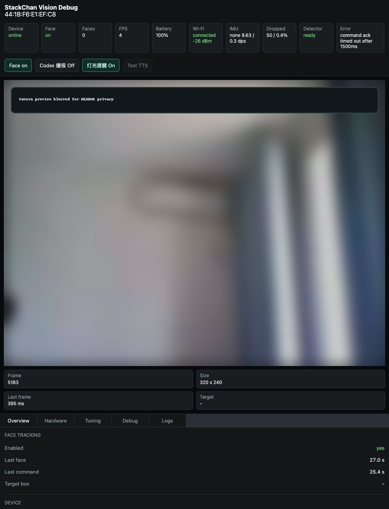
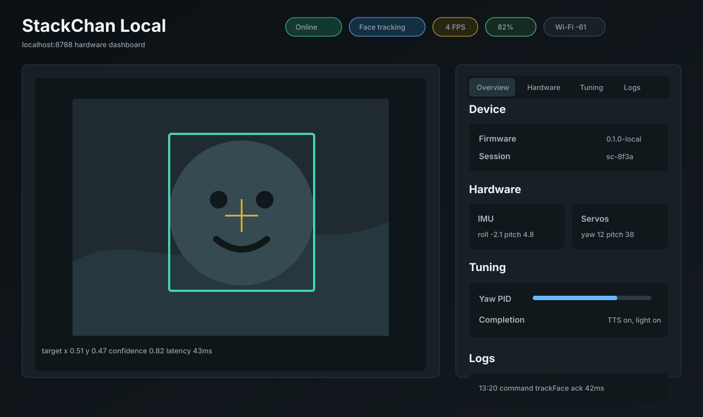
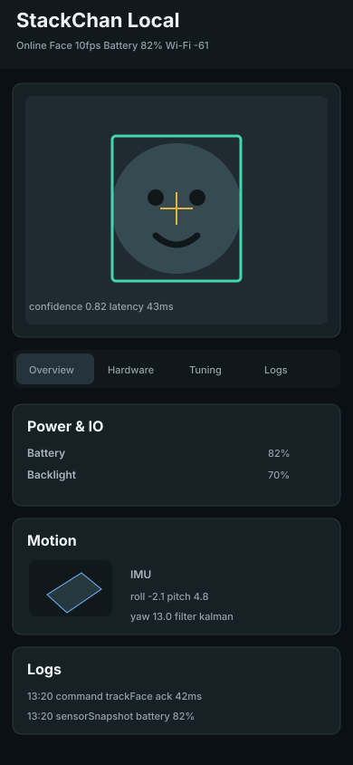
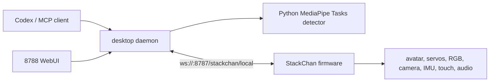

# StackChan Local

[English](README.md) | [中文](README_zh.md)

StackChan Local 把 M5Stack StackChan 改造成一个本地优先的 Codex 桌面机器人。运行时不依赖原始云端 server 或手机 App，硬件通过局域网 WebSocket 连接电脑上的 TypeScript daemon。

这个项目适合想要一个实体 Codex companion 的玩家：它可以显示 `idle`、`thinking`、`speaking` 状态，在 Codex 任务完成后播报和闪灯，使用本地 MediaPipe Tasks Face Landmarker 做人脸追踪，并在浏览器里展示实时硬件调试面板。

## 功能

- **本地优先运行时**：桌面端和固件通过局域网通信，核心控制链路不需要云端 server。
- **Codex 状态同步**：把 Codex 的任务状态映射到 StackChan 的表情、灯光和模式。
- **任务完成提醒**：Codex 任务结束后可选 TTS 播报，并让 RGB 灯闪烁。
- **人脸追踪**：硬件摄像头低帧率回传 JPEG，电脑本地 MediaPipe Tasks 检测人脸 landmarks、pose 和表情提示，并控制头部平滑跟随。
- **8788 调试面板**：展示摄像头画面、人脸框、PID 调参、传感器、设备状态、命令 ACK 和结构化日志。
- **MCP 工具**：Codex 可以控制说话、表情、头部运动、动画、拍照、模式和人脸追踪。
- **Local Companion 固件模式**：开机进入 StackChan 脸部 UI，支持本地 WebSocket、眨眼、待机随机动作、传感器事件和断连空闲关机。

## 截图

<p align="center">
  
</p>

<p align="center">
  <sub>真实本地 WebUI 会话。摄像头画面已模糊处理，避免 README 暴露房间细节。</sub>
</p>

<table>
  <tr>
    <td width="58%">
      
    </td>
    <td width="42%">
      
    </td>
  </tr>
  <tr>
    <td align="center"><sub>桌面仪表盘布局</sub></td>
    <td align="center"><sub>手机竖屏布局</sub></td>
  </tr>
</table>

## 目录结构

```text
.
├── desktop/          TypeScript daemon、MCP server、WebUI、人脸检测集成
├── firmware/         StackChan Local Companion 的 ESP-IDF 固件工程
├── protocol/         共享 TypeScript 类型和 JSON Schema 校验
├── docs/             架构、配置、WebUI、固件、协议、排障文档
└── scripts/          桌面端和固件工作流脚本
```

## 文档

- [安装与启动](docs/setup.md)
- [配置项](docs/configuration.md)
- [架构](docs/architecture.md)
- [WebUI](docs/web-ui.md)
- [Codex MCP](docs/codex-mcp.md)
- [本地协议](docs/protocol.md)
- [固件](docs/firmware.md)
- [排障](docs/troubleshooting.md)

## 架构



桌面 daemon 负责协议校验、设备注册、命令 ACK、运动仲裁、Codex session 监听、人脸检测调度、TTS 下发和 8788 WebUI。固件负责本地 UI、摄像头、音频播放、唤醒词链路、舵机、RGB、传感器和断线重连。

## 快速开始

### 1. 安装桌面端依赖

```bash
npm install
cp .env.example .env
```

编辑 `.env`，至少修改 `STACKCHAN_PAIRING_TOKEN`。

### 2. 启动 daemon

```bash
npm run dev
```

默认端点：

- 设备 WebSocket：`ws://<mac-ip>:8787/stackchan/local`
- WebUI：`http://localhost:8788`
- mDNS 服务：`_stackchan-local._tcp`

### 3. 可选：安装人脸追踪依赖

```bash
npm run vision:install
npm run vision:model
STACKCHAN_FACE_TRACKING=1 npm run dev
```

### 4. 编译和烧录固件

```bash
source ~/esp/esp-idf-v5.5.4/export.sh
python3 firmware/fetch_repos.py
npm run firmware:build
npm run firmware:check-local-only
cd firmware
idf.py -p /dev/cu.usbmodem21301 flash
```

等价的原始 ESP-IDF 命令：

```bash
cd firmware
python3 ./fetch_repos.py
idf.py set-target esp32s3
idf.py build
idf.py flash monitor
```

如果设备没有保存 Wi-Fi，固件会启动 `StackChan-XXXX` 热点。连接该热点后打开 `http://192.168.4.1` 配置 Wi-Fi。

### 固件本地构建隔离

默认固件构建已经对复制进来的 legacy cloud 代码做编译级隔离。`CONFIG_STACKCHAN_LOCAL_ENABLE_LEGACY_CLOUD` 默认是 `n`，CMake 会排除旧 Launcher/cloud App、App Center、EzData、云 Avatar WebSocket、云 OTA、Xiaozhi cloud Application、MQTT/WebSocket protocol client 和 4G/RNDIS board 路径。

local-only 构建会定义 `STACKCHAN_LOCAL_DISABLE_LEGACY_CLOUD=1`，编译裁掉 camera explain HTTP 路径，并使用 `firmware/main/local_xiaozhi/application_local_stub.cc` 替代上游 cloud `application.cc`。每次固件构建后可以用下面命令确认 legacy cloud 源码没有进入编译数据库：

```bash
npm run firmware:check-local-only
```

## WebUI

8788 页面适配桌面宽屏和手机竖屏。

主要页面：

- **Overview**：设备状态、人脸追踪、当前目标、capabilities。
- **Hardware**：电池、Wi-Fi、BLE、RTC、扬声器、RGB、摄像头、舵机、IMU、触摸和外设占位状态。
- **Tuning**：摄像头 preset、PID 参数、追踪预设、Codex 完成播报音量、播报开关、灯光提醒开关。
- **Debug**：session id、固件版本、最近事件、计数器和清理后的状态快照。
- **Logs**：daemon 内存 ring buffer 日志，支持 level、type 和搜索过滤。

## MCP 工具

```bash
npm run mcp
```

当前工具：

- `stackchan_status`
- `stackchan_say`
- `stackchan_react`
- `stackchan_move_head`
- `stackchan_play_animation`
- `stackchan_capture_image`
- `stackchan_set_mode`
- `stackchan_face_tracking`

## 配置

常用配置见 [.env.example](.env.example)。

重要默认值：

- `STACKCHAN_LOCAL_PORT=8787`
- `STACKCHAN_PREVIEW_PORT=8788`
- `STACKCHAN_PAIRING_TOKEN=dev-local-token`
- `STACKCHAN_FACE_TRACKING=0`
- `STACKCHAN_FACE_TRACKING_CAMERA_PRESET=fast`
- `STACKCHAN_CODEX_STATUS=1`
- `STACKCHAN_VOLCENGINE_TTS_ENABLED=0`

真实 API key 和 pairing token 不要提交到 Git。

## 测试

```bash
npm run typecheck
npm test
```

桌面端和协议层的合并检查：

```bash
npm run check
```

固件：

```bash
source ~/esp/esp-idf-v5.5.4/export.sh
npm run firmware:build
npm run firmware:check-local-only
```

开源发布前检查：

```bash
npm run open-source:check
```

## 隐私和安全

- 人脸追踪只做本地检测和姿态估计，不做身份识别。
- 摄像头帧只在局域网内的硬件和 daemon 之间传输。
- 麦克风定位方案已经移除；麦克风只保留给唤醒词和语音音频链路。
- 云 TTS 默认关闭；开启后只会把完成播报文本发给配置的 TTS provider。
- `.env`、真实 token 和 provider key 不应进入 Git。

## 项目状态

这是一个实验性硬件/软件项目。当前目标是 macOS 桌面端加 M5Stack StackChan 硬件。本地优先架构已经具备，但固件配置、发布包和跨平台桌面端还需要继续打磨。

## License

StackChan Local 项目代码使用 MIT License。第三方源码和 ESP-IDF 依赖保留各自许可证。
