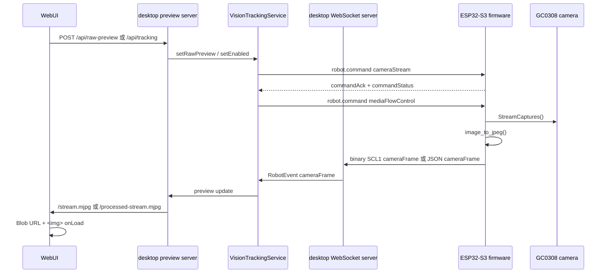

# 摄像头视频链路

本文档说明 GC0308 摄像头视频从固件采集、ESP32-S3 推送、desktop daemon 接收，到 WebUI 页面展示的完整路径。这里的“视频”不是 H.264/RTSP 流，而是一串 JPEG 帧：固件按 `cameraStream.fps` 周期采集并编码 JPEG，desktop 再转成 MJPEG HTTP 流给浏览器显示。

## 总览



## 启动入口

页面上有两条入口会开启同一条固件相机流：

| 入口 | HTTP | desktop 行为 | stream owner |
| --- | --- | --- | --- |
| Camera tab | `POST /api/raw-preview` | `VisionTrackingService.setRawPreview()`，用于只看原始画面 | `rawPreview` |
| Face Tracking app | `POST /api/tracking` | `VisionTrackingService.setEnabled()`，用于人脸检测和追踪 | `faceTracking` |
| 硬件相机命令 | `POST /api/hardware/camera-stream` | 直接调用 `RobotController.cameraStream()` | 不改变 Vision owner |

`VisionTrackingService.desiredCameraStream()` 只维护一个 active owner。当前逻辑里 raw preview 优先于 face tracking：如果 Camera tab 的 raw preview 开着，就使用 raw preview 的相机参数；否则 tracking 开启时使用 face tracking 参数。

## WebSocket 握手

设备连接 desktop WebSocket `ws://<desktop-ip>:8787/stackchan/local` 后，先发 `handshake`：

```ts
type HandshakeMessage = {
  type: "handshake";
  deviceId: string;
  firmwareVersion: string;
  capabilities: DeviceCapability[];
  audioParams: AudioParams;
  pairingToken: string;
};
```

desktop 返回 `daemon.hello`：

```ts
type DaemonHelloMessage = {
  type: "daemon.hello";
  protocolVersion?: "1.1" | "1.2";
  sessionId: string;
  heartbeatIntervalMs: number;
  featureFlags: string[];
  featureParams?: {
    binaryCameraFrame?: { envelope: "SCL1"; cameraKind: 1 };
    mediaCredit?: { defaultCreditFrames: number; maxCreditFrames: number };
  };
  qosProfiles?: {
    robotCommand: "reliable";
    cameraFrame: "latestOnly";
    telemetry: "bestEffort";
    audio: "reliableChunked";
  };
  audioParams: AudioParams;
};
```

当前 desktop 会声明 `binaryCameraFrame`、`mediaCredit`、`adaptiveCameraStream` 和 `qosProfiles`。固件收到后：

- `_binary_camera_frame_enabled=true`：优先用二进制 `SCL1` 传 JPEG，避免 JSON base64 放大。
- `_camera_credit_enabled=true`：相机帧需要 desktop 授权 credit 才发送。
- `_camera_max_in_flight` 取 `featureParams.mediaCredit.maxCreditFrames`，固件再 clamp 到最大 12。

## 控制命令

所有命令都包在同一个 WebSocket envelope：

```ts
type RobotCommandMessage = {
  type: "robot.command";
  seq?: number;
  commandId: string;
  command: RobotCommand;
};
```

### cameraStream

```ts
type CameraStreamCommand = {
  kind: "cameraStream";
  enabled: boolean;
  fps?: number;
  width?: number;
  height?: number;
  quality?: number;
  format?: "jpeg";
};
```

实现细节：

- desktop 的 raw preview 默认 `320x240, 15 FPS, quality=14`。
- face tracking 默认 `320x240, 15 FPS, quality=18`。
- 固件只支持 `320x240`，请求其它分辨率会记录 `fallbackReason="unsupported_resolution"`，实际仍使用 `320x240`。
- 固件把 `fps` clamp 到 `1..15`，并用 `intervalMs = 1000 / fps` 控制采样周期。
- 固件把 `quality` clamp 到 `1..100`。
- 当前 JSON schema 里 `fps` 仍写 `1..10`，但 desktop 和固件实际都允许 15 FPS；这是协议 schema 与运行实现的一个现存不一致点。

固件收到后返回：

```ts
type CommandAckEvent = {
  kind: "commandAck";
  commandId: string;
  commandKind: "cameraStream";
  status: "accepted" | "rejected";
  message?: string;
};

type CommandStatusEvent = {
  kind: "commandStatus";
  commandId: string;
  commandKind: "cameraStream";
  status: "started" | "completed" | "failed" | "cancelled";
  message?: string;
  progress?: number;
};
```

### mediaFlowControl

```ts
type MediaFlowControlCommand = {
  kind: "mediaFlowControl";
  stream: "camera";
  creditFrames: number;
  maxInFlight?: number;
  reason?: string;
};
```

作用是背压控制，避免相机帧堆积。当前 raw preview 和 face tracking 都使用 `maxInFlight=1`，desktop 通常每处理完一帧再 grant 1 frame。

desktop 发送 credit 的时机：

- camera stream 刚启动：grant 初始 frame。
- raw preview 收到一帧并准备好继续展示：grant 下一帧，`reason="raw preview ready"`。
- face tracking detector 完成或跳过采样：grant 下一帧，`reason="detector ready"` 或 `reason="detector sample skipped"`。

固件收到后只更新本地计数，不发 ACK：

```text
_camera_credit_frames =
  min(_camera_credit_frames + creditFrames, _camera_max_in_flight)
```

固件相机任务只有在 `_camera_credit_frames > 0` 时才采集并发送下一帧。成功发送 camera frame 后，固件把 credit 减 1。

## 固件采集与编码

固件相机任务循环周期是 20 ms。每次检查：

```text
if camera stream disabled: skip
if now - lastFrameTime < intervalMs: skip
if mediaCredit enabled and credit <= 0: skip
if websocket not connected: skip
```

可以发送时：

1. `captureTimestamp = iso_now()`，记录本帧开始时间。
2. `camera->StreamCaptures(wait_for_fresh_frame)`：
   - 当 `intervalMs >= 120`，等待 fresh frame。
   - 高 FPS 场景不等待 fresh frame，降低阻塞。
3. 读取 `GetFrameData()`、`GetFrameSize()`、`GetFrameWidth()`、`GetFrameHeight()`。
4. 调用 `image_to_jpeg(..., jpegQuality, &jpeg_data, &jpeg_len)`。
5. `deviceEncodedAt = iso_now()`。
6. 调用 `send_camera_frame(...)`，优先走二进制 `SCL1`。

固件内部还会记录以下耗时：

| 字段 | 含义 |
| --- | --- |
| `_last_camera_capture_ms` | `StreamCaptures()` 耗时 |
| `_last_camera_encode_ms` | `image_to_jpeg()` 耗时 |
| `_last_camera_send_ms` | WebSocket send 调用耗时 |
| `_last_camera_total_ms` | 从准备采集到发送结束的总耗时 |
| `_last_camera_frame_interval_ms` | 相邻发送成功帧间隔 |
| `_last_camera_jpeg_bytes` | 最近一帧 JPEG 字节数 |

这些内部字段用于诊断，但当前 `hardwareStatus` 的 camera 状态已经精简，不再把这些字段作为低频状态字段推送。

## 设备到 desktop 的帧协议

### 首选：二进制 SCL1

当 `daemon.hello.featureFlags` 包含 `binaryCameraFrame` 时，固件发送二进制 WebSocket message：

```text
byte 0..3   ASCII "SCL1"
byte 4      kind = 0x01
byte 5      reserved = 0
byte 6..7   headerLength, uint16 big-endian
byte 8..N   UTF-8 JSON header
rest        JPEG bytes
```

header JSON：

```ts
type BinaryCameraFrameHeader = {
  frameId: string;
  deviceId: string;
  timestamp: string;
  mimeType: "image/jpeg";
  width: number;
  height: number;
  byteLength: number;
  transport: "binary";
  seq?: number;
  captureTimestamp?: string;
  sentAt?: string;
  deviceEncodedAt?: string;
  deviceQueuedAt?: string;
  deviceTxStartAt?: string;
};
```

固件填充的时间戳：

| header 字段 | 来源 |
| --- | --- |
| `timestamp` / `captureTimestamp` | 本帧采集开始时 |
| `deviceEncodedAt` | JPEG 编码完成后 |
| `deviceQueuedAt` | camera frame 入发送队列时 |
| `deviceTxStartAt` | TX task 准备真正发送二进制 payload 时 |
| `sentAt` | 当前等同于 `deviceTxStartAt` |

二进制相机消息使用独立 camera TX 队列，`kCameraTxQueueMax=1`。如果新帧到来时队列已满，会丢弃旧相机帧，只保留最新帧，匹配 `qosProfiles.cameraFrame="latestOnly"`。

### 兜底：JSON cameraFrame

如果二进制能力未开启，固件发送普通 JSON `robot.event`：

```ts
type RobotEventMessage = {
  type: "robot.event";
  seq?: number;
  eventId: string;
  deviceId: string;
  timestamp: string;
  event: CameraFrameEvent;
};

type CameraFrameEvent = {
  kind: "cameraFrame";
  frameId: string;
  mimeType: "image/jpeg";
  width: number;
  height: number;
  dataBase64: string;
  seq?: number;
  captureTimestamp?: string;
  sentAt?: string;
  trace?: ProtocolTrace;
};

type ProtocolTrace = {
  deviceCapturedAt?: string;
  deviceEncodedAt?: string;
  deviceQueuedAt?: string;
  deviceSentAt?: string;
  deviceTxStartAt?: string;
  daemonReceivedAt?: string;
  detectorStartedAt?: string;
  detectorFinishedAt?: string;
};
```

JSON 方式会把 JPEG 转 base64，体积约增加 33%。当前 desktop 支持 JSON 兜底，但正常链路会走二进制。

## desktop 接收

desktop WebSocket server 收到二进制帧后：

1. 用 `parseStackChanBinaryFrame()` 验证 magic、kind、header length、header JSON、`byteLength`。
2. 校验 `header.deviceId` 必须等于当前 WebSocket session 的设备 ID。
3. 把 JPEG bytes 转成 base64，构造内存里的 `RobotEventMessage { kind:"cameraFrame" }`。
4. 补 `trace.daemonReceivedAt = new Date().toISOString()`。
5. 用协议 validator 校验事件结构。
6. `DeviceRegistry.recordEvent(message)` 更新 session `lastSeenAt`。
7. `VisionTrackingService.handleEvent(message)` 消费该帧。

注意：desktop 内部为了统一处理，二进制帧进入 VisionTrackingService 前会转成 base64 存在内存里；但公开 `/status` snapshot 不返回 `dataBase64`，只返回 metadata，避免 snapshot 过大。

## VisionTrackingService 处理

收到 `cameraFrame` 后：

1. 只有 raw preview 或 face tracking 至少一个开启时才处理帧。
2. 更新 `framesReceived`、`lastFrameAt`、`lastFrame`。
3. 如果启用了 media credit，`outstandingFrames -= 1`。
4. 触发 preview update，PreviewServer 会广播 MJPEG 和 SSE snapshot。
5. 如果 face tracking 没开启，或者本帧距离上一次 detector 输入小于 `1000 / fps`，不跑 detector，只 grant 下一帧 credit。
6. 如果 detector 正忙：
   - `framesDropped += 1`
   - 不排队旧帧
   - 触发 adaptive backpressure 判断
7. 如果 detector 空闲，调用 Python OpenCV sidecar 检测人脸。
8. detector 完成后给当前 frame trace 补：
   - `detectorStartedAt`
   - `detectorFinishedAt`
9. 如果检测到目标，desktop 下发 `trackFace(centerX, centerY, bbox, confidence)`。
10. 最后 grant 下一帧 camera credit。

adaptive backpressure 当前看两个指标：

- detector latency 是否超过当前帧间隔的 80%。
- 5 秒窗口内 drop rate 是否超过 8%。

压力持续 5 秒后提升 adaptive level，降低相机压力；稳定 15 秒后逐步恢复。

## PreviewServer 到页面

PreviewServer 提供两类 MJPEG HTTP 流：

| URL | 内容 |
| --- | --- |
| `/stream.mjpg` | raw frame，只要有最新 camera frame 就发 |
| `/processed-stream.mjpg` | processed frame，只有 `trace.detectorFinishedAt` 存在时才发，用于 Face Tracking 叠人脸框 |
| `/frame.jpg` | 当前 raw 单帧 JPEG |
| `/processed-frame.jpg` / `/face-frame.jpg` | 当前 processed 单帧 JPEG |

这里的 processed stream 不是服务端画过框的新 JPEG。它仍然是原始 JPEG bytes，只是 PreviewServer 要求该帧已经完成 detector，前端再根据 snapshot 里的 `target` 叠加人脸框。

MJPEG 每个 part 的 header：

```http
--stackchanframe
content-type: image/jpeg
content-length: <jpeg bytes>
x-frame-id: <frameId>
x-frame-timestamp: <capture timestamp>
x-frame-received-at: <desktop receivedAt>
x-frame-sent-at: <firmware sentAt>
x-frame-capture-timestamp: <firmware captureTimestamp>
x-frame-device-encoded-at: <deviceEncodedAt>
x-frame-device-queued-at: <deviceQueuedAt>
x-frame-device-tx-start-at: <deviceTxStartAt>
x-frame-stream: raw | processed
x-detector-finished-at: <detectorFinishedAt, processed only>
```

PreviewServer 对慢浏览器也有背压保护：

- 每个 MJPEG client 记住 `lastFrameId`，同一帧不会重复写。
- 如果响应正在 drain，跳过本次写入。
- 如果 `response.writableLength > 512 KiB`，跳过本次写入。

## 前端展示

`CameraPreview` 使用 `useMjpegStream()` 读取 MJPEG：

1. `fetch("/stream.mjpg")` 或 `fetch("/processed-stream.mjpg")`。
2. 用 boundary `--stackchanframe` 和 `content-length` 手动拆 frame。
3. 每帧 JPEG bytes 转成 `Blob`。
4. `URL.createObjectURL(blob)` 得到 `objectUrl`。
5. `` 触发浏览器 JPEG decode。
6. `` 时记录 `displayedAt`。
7. 如果是 Face Tracking 页面，使用 snapshot 里的 `target` 在 `` 上叠加 `.face-box`。

页面上的延迟显示来自 `CameraPreview`：

```text
raw display:
  优先 captureTimestamp -> displayedAt
  否则 daemonReceivedAt -> displayedAt
  再否则 status.latency.* 字段

processed display:
  优先 captureTimestamp -> displayedAt
  否则 detectorFinishedAt -> displayedAt
  再否则 detectorLatencyMs / detectorEndToEndMs

breakdown:
  cap+enc = captureTimestamp -> deviceEncodedAt
  queue   = deviceEncodedAt -> deviceQueuedAt
  tx wait = deviceQueuedAt -> deviceTxStartAt
  tx      = deviceTxStartAt 或 sentAt -> daemonReceivedAt
  web     = daemonReceivedAt -> displayedAt
```

## 耗时字段

`/status?full=1` 的 `status.latency`：

| 字段 | 计算 |
| --- | --- |
| `frameAgeMs` | `Date.now() - lastFrameAt` |
| `deviceToDaemonMs` | `sentAt -> receivedAt` |
| `captureToDaemonMs` | `captureTimestamp -> receivedAt` |
| `detectorEndToEndMs` | `captureTimestamp -> detectorFinishedAt` |

`frame.trace` 里可进一步拆解：

| 阶段 | 计算 | 含义 |
| --- | --- | --- |
| capture + encode | `captureTimestamp -> deviceEncodedAt` | 固件等待/抓取 frame + JPEG 编码 |
| queue | `deviceEncodedAt -> deviceQueuedAt` | 编码后进入 TX 队列的延迟 |
| TX wait | `deviceQueuedAt -> deviceTxStartAt` | 在 camera TX 队列中等待发送 |
| network + WS receive | `deviceTxStartAt -> daemonReceivedAt` | ESP32 发送到 desktop 收到 |
| detector | `detectorStartedAt -> detectorFinishedAt` | desktop OpenCV 检测 |
| end-to-end processed | `captureTimestamp -> detectorFinishedAt` | 人脸检测完成前总耗时 |
| browser display | `daemonReceivedAt -> displayedAt` | PreviewServer 写 MJPEG、浏览器解析、JPEG decode、img onLoad |

## 当前实测样例

以下是本机在 `2026-06-01` 从当前运行实例读取的一帧 processed frame。摄像头配置为 `320x240, 15 FPS, quality=18`，media credit 开启，owner 是 `faceTracking`。

```json
{
  "frameId": "2940",
  "jpegBytes": 2304,
  "captureToEncodeMs": 68,
  "encodeToQueueMs": 0,
  "queueToTxMs": 1,
  "txToDaemonMs": 97,
  "captureToDaemonMs": 166,
  "detectorMs": 17,
  "captureToDetectorEndMs": 183
}
```

另一帧 `/status?full=1` 的 `status.latency`：

```json
{
  "frameAgeMs": 68,
  "deviceToDaemonMs": 95,
  "captureToDaemonMs": 151,
  "detectorEndToEndMs": 171
}
```

这些值会随 Wi-Fi、JPEG 大小、光照、OpenCV 检测耗时和浏览器渲染状态波动。当前链路里通常最大的两段是：

1. 固件 capture + JPEG encode。
2. ESP32 到 desktop 的 WebSocket 传输。

OpenCV 检测在这个样例里约 17 到 20 ms。

## 常见问题与排查点

| 现象 | 可能原因 | 看哪里 |
| --- | --- | --- |
| 页面没有图像 | raw preview/tracking 未开启；设备未在线；camera unavailable | `/status?full=1` 的 `devices`、`status.sourceCamera` |
| FPS 低 | media credit 没回补、detector 忙、adaptive 降级、Wi-Fi 慢 | `status.mediaCredit`、`framesDropped`、`detectorLatencyMs` |
| processed 画面不更新 | detector 未完成或 down | `detectorAvailable`、`trace.detectorFinishedAt` |
| raw 有图但 processed 无图 | face tracking 未启用或无 detector output | Face Tracking 页状态 |
| snapshot 很大 | 不应来自 `/status`；公开 snapshot 不带 `dataBase64` | `/stream.mjpg` 才传 JPEG bytes |
| 延迟大 | capture/encode 或 tx 段变大 | CameraPreview breakdown、`frame.trace` |

## 代码索引

| 环节 | 文件 |
| --- | --- |
| 相机命令应用 | `firmware/main/services/local_companion/camera_stream_service.cpp` |
| 固件采集/编码/发送 | `firmware/main/services/local_companion/local_companion_service.cpp` |
| 二进制帧解析 | `desktop/src/ws/binary-frame.ts` |
| WebSocket 接收和 `daemon.hello` | `desktop/src/ws/server.ts` |
| cameraStream/mediaFlowControl 命令发送 | `desktop/src/robot/controller.ts` |
| Vision 流控制、credit、detector、latency | `desktop/src/vision/tracking.ts` |
| Preview HTTP/MJPEG | `desktop/src/preview/server.ts` |
| 前端 MJPEG parser | `desktop/preview-ui/src/hooks/useMjpegStream.ts` |
| 前端展示与延迟计算 | `desktop/preview-ui/src/components/CameraPreview.tsx` |
| Camera tab | `desktop/preview-ui/src/features/modules/CameraModule.tsx` |
| Face Tracking app | `desktop/preview-ui/src/features/apps/FaceTrackingApp.tsx` |
