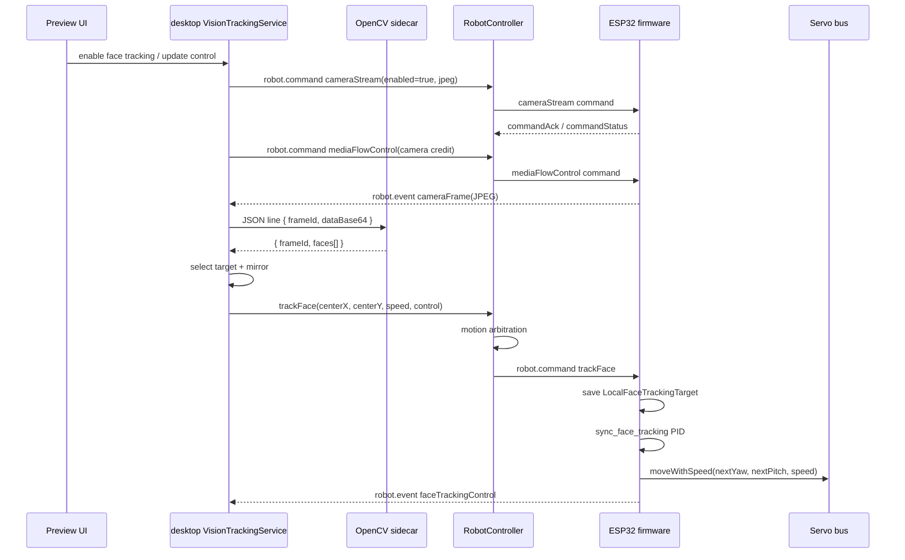

# 人脸追踪流程

本文档描述当前 OpenCV YuNet 人脸追踪链路，包括视频输入、YuNet 检测、目标筛选、`trackFace` 命令、桌面端运动仲裁、固件 PID 控制，以及所有已经存在的兜底逻辑。

当前职责划分：

| 位置 | 职责 |
| --- | --- |
| 固件 camera | 采集并发送 JPEG `cameraFrame` |
| desktop `VisionTrackingService` | 管理相机流、运行 OpenCV YuNet sidecar、选择目标、下发 `trackFace`、记录 trace |
| desktop `RobotController` | 统一发送 `robot.command`，做人脸追踪和手动/动画/音频动作的运动仲裁 |
| 固件 `LocalCompanionService` | 接收 `trackFace`，保存目标中心点和 PID 参数 |
| 固件 `AppLocalCompanion` | 按固定周期运行 PID，转换成舵机增量并调用 `moveWithSpeed` |

## 端到端链路



## 相机流与背压

人脸追踪不主动拉 HTTP 图像，而是通过设备 WebSocket 收 `robot.event cameraFrame`。

1. 开启追踪时，desktop 发送：

```ts
{
  kind: "cameraStream",
  enabled: true,
  fps: number,
  width: 320,
  height: 240,
  quality: number,
  format: "jpeg"
}
```

2. 固件开始推送 `cameraFrame`。当前帧数据在 desktop 内部保持 JPEG `Buffer`，检测 sidecar 调用时才转换成 base64 JSON line。
3. 设备支持 `mediaCredit` 时，desktop 用 `mediaFlowControl` 控制固件最多发送多少未消费帧。

当前 media credit 参数：

| 场景 | initial credit | steady credit | maxInFlight | refillThreshold |
| --- | ---: | ---: | ---: | ---: |
| faceTracking | `2` | `1` | `2` | `1` |
| rawPreview | `4` | `1` | `4` | `3` |

相机流 owner 优先级：

| owner | 条件 | 说明 |
| --- | --- | --- |
| `rawPreview` | Raw preview 开启 | 优先使用 Raw preview 的 fps/quality，同时追踪仍可复用这些帧做检测 |
| `faceTracking` | Raw preview 关闭且追踪开启 | 使用人脸追踪配置 |
| `idle` | 两者都关闭 | 发送 `cameraStream(enabled=false)` 停止流 |

默认相机 preset：

| preset | width | height | fps | quality |
| --- | ---: | ---: | ---: | ---: |
| `fast` | `320` | `240` | `15` | `18` |
| `accurate` | `320` | `240` | `6` | `28` |
| `debug` | `320` | `240` | `2` | `35` |

`.env` 默认 `STACKCHAN_FACE_TRACKING_CAMERA_PRESET=fast`。

## OpenCV YuNet 检测

检测逻辑在 `desktop/scripts/face_detector.py`。

desktop 向 Python sidecar 每次发送一行 JSON：

```ts
{
  frameId: string;
  width: number;
  height: number;
  dataBase64: string;
  timestampMs: number;
}
```

sidecar 处理步骤：

1. base64 解码 JPEG。
2. `cv2.imdecode(..., cv2.IMREAD_COLOR)` 解码成 BGR 图像。
3. 按当前帧尺寸设置 `cv2.FaceDetectorYN` input size。
4. 运行 `face_detection_yunet_2023mar.onnx`。
5. YuNet 在模型内部按 `score_threshold` 和 `nms_threshold` 过滤候选框。
6. 输出归一化 bbox、真实模型分数和 5 个关键点：

```ts
{
  frameId: string;
  faces: Array<{
    x: number;          // 0..1
    y: number;          // 0..1
    width: number;      // 0..1
    height: number;     // 0..1
    confidence: number; // YuNet face score, 0..1
    detector: "yunet";
    landmarks: {
      leftEye?: { x: number; y: number };
      rightEye?: { x: number; y: number };
      nose?: { x: number; y: number };
      mouthLeft?: { x: number; y: number };
      mouthRight?: { x: number; y: number };
      mouthCenter?: { x: number; y: number };
    };
  }>;
}
```

YuNet 参数：

```env
STACKCHAN_FACE_TRACKING_YUNET_MODEL=desktop/models/face_detection_yunet_2023mar.onnx
STACKCHAN_FACE_TRACKING_YUNET_SCORE_THRESHOLD=0.85
STACKCHAN_FACE_TRACKING_YUNET_NMS_THRESHOLD=0.3
STACKCHAN_FACE_TRACKING_YUNET_TOP_K=500
```

`confidence` 是 YuNet 输出的真实 face score，页面和日志可以用它判断检测可信度。

## desktop 目标选择

`VisionTrackingService` 收到 `faces[]` 后先选择候选目标。

候选目标过滤：

```text
face.width > 0 && face.height > 0
```

目标评分：

```text
area = width * height
confidence = face.confidence || 0
distanceFromCenter = hypot(centerX - 0.5, centerY - 0.5)
distanceFromPrevious = hypot(center - previousTargetCenter)

score =
  area
  + confidence * 0.02
  - distanceFromCenter * 0.05
  - distanceFromPrevious * 0.18
```

含义：

| 因子 | 效果 |
| --- | --- |
| `area` | 人脸框越大越优先 |
| `confidence * 0.02` | 同等面积下优先 YuNet 分数更高的候选 |
| `distanceFromCenter * 0.05` | 稍微偏向画面中心 |
| `distanceFromPrevious * 0.18` | 保持上一目标，降低目标频繁切换 |

配置项：

```env
STACKCHAN_FACE_TRACKING_YAW_DIRECTION=1
STACKCHAN_FACE_TRACKING_PITCH_DIRECTION=1
```

如果设置 `STACKCHAN_FACE_TRACKING_MIRROR_X=true`，desktop 会在下发命令前做水平镜像：

```ts
trackingTarget.x = 1 - selected.x - selected.width;
```

下发中心点：

```ts
centerX = trackingTarget.x + trackingTarget.width / 2;
centerY = trackingTarget.y + trackingTarget.height / 2;
```

当前命令路径没有使用 One Euro / alpha-beta 滤波；`OneEuroFilter` 类仍存在于代码和测试里，但当前 `trackFace` 下发路径只使用目标选择。

## desktop 不做目标门控

当前 desktop 已删除目标面积过滤、跳变确认、重捕获稳定帧确认这类目标门控。OpenCV sidecar 返回 `faces[]` 后，desktop 只做目标选择、可选镜像和中心点计算。

有目标时：

1. 用 `selectTrackingFace()` 按评分选择人脸。
2. 如果 `STACKCHAN_FACE_TRACKING_MIRROR_X=true`，先水平镜像。
3. 计算 `centerX/centerY`。
4. 立即发送 `trackFace(detected=true)`。
5. 写入 `faceDetection action=target_ready` 和 `trackCommand` 日志。

无目标时：

1. `lastTarget = undefined`。
2. 写入 `faceDetection action=no_face`。
3. 更新页面 preview。
4. 不发送 `trackFace(detected=false)`，也不发送 `face_lost`。

这意味着小框、边缘框、远距离跳变框只要被 OpenCV 选中，都会直接下发给固件；desktop 不再尝试判断它是否是误检。

## 命令发送节奏

desktop 已删除 `trackFace detected=true` 的命令限频。每次 detector 产出可选目标，都会尝试下发一条 `trackFace`。

实际命令节奏仍会被这些因素间接限制：

| 限制来源 | 说明 |
| --- | --- |
| 相机 fps | 默认 fast preset 是 `15fps` |
| detector sampling | `shouldRunDetector()` 按当前追踪相机 fps 跳过过密帧 |
| detector inFlight | 上一次检测没结束时会丢弃当前检测输入 |
| media credit | 固件支持时会限制在途 camera frame |
| RobotController motion gate | 手动动作、动画、音频播放仍可阻止追踪抢舵机 |

关闭追踪、手动移动、动画、音频播放仍会通过 `RobotController` 发送 `trackFace(detected=false)` 来暂停追踪；这属于显式动作暂停，不属于“丢脸兜底”。

## trackFace 协议

WebSocket envelope 不变：

```ts
{
  type: "robot.command";
  seq?: number;
  commandId: string;
  command: RobotCommand;
}
```

当前 `trackFace` payload：

```ts
type TrackFaceCommand = {
  kind: "trackFace";
  detected: boolean;
  centerX?: number;       // 0..1，detected=true 必填
  centerY?: number;       // 0..1，detected=true 必填
  bbox?: NormalizedFaceBox;
  confidence?: number;    // 0..1
  speed?: number;         // 0..1000
  control?: FaceTrackingControl;
  reason?: string;
};

type FaceTrackingControl = {
  mode: "pid";
  deadband: number;       // 0..0.3，归一化画面坐标
  yaw: { kp: number; ki: number; kd: number; direction: -1 | 1 };
  pitch: { kp: number; ki: number; kd: number; direction: -1 | 1 };
  integralLimit: number;  // 0..2
  outputLimitDeg: number; // 1..45
};
```

schema 规则：

| 字段 | 规则 |
| --- | --- |
| `kind` | 必须是 `"trackFace"` |
| `detected` | 必填 boolean |
| `centerX` / `centerY` | `0..1`，`detected=true` 时必填 |
| `bbox` | `x/y/width/height` 均归一化，允许携带 `confidence/trackingId/landmarks/pose/expression/detector`，但当前 OpenCV 只填 bbox 和 confidence |
| `confidence` | `0..1` |
| `speed` | `0..1000` |
| `control.mode` | 必须是 `"pid"` |
| `control.deadband` | `0..0.3` |
| `control.yaw/pitch.kp` | `0..150` |
| `control.yaw/pitch.ki` | `0..50` |
| `control.yaw/pitch.kd` | `0..80` |
| `control.yaw/pitch.direction` | `-1` 或 `1`，用于现场校准舵机安装方向 |
| `control.integralLimit` | `0..2` |
| `control.outputLimitDeg` | `1..45` |

`detected=false` 可以只带 `reason`，也可以带 `speed/control`。

## 默认控制参数

desktop 从 `.env` 读取参数并 clamp：

| 环境变量 | 默认值 | clamp |
| --- | ---: | --- |
| `STACKCHAN_FACE_TRACKING_SPEED` | `300` | `0..1000` |
| `STACKCHAN_FACE_TRACKING_DEADBAND` | `0.08` | `0..0.3` |
| `STACKCHAN_FACE_TRACKING_YAW_KP` | `36` | `0..150` |
| `STACKCHAN_FACE_TRACKING_YAW_KI` | `0` | `0..50` |
| `STACKCHAN_FACE_TRACKING_YAW_KD` | `1.2` | `0..80` |
| `STACKCHAN_FACE_TRACKING_PITCH_KP` | `8` | `0..150` |
| `STACKCHAN_FACE_TRACKING_PITCH_KI` | `0` | `0..50` |
| `STACKCHAN_FACE_TRACKING_PITCH_KD` | `0.15` | `0..80` |
| `STACKCHAN_FACE_TRACKING_INTEGRAL_LIMIT` | `0.35` | `0..2` |
| `STACKCHAN_FACE_TRACKING_OUTPUT_LIMIT_DEG` | `4` | `1..45` |
| `STACKCHAN_FACE_TRACKING_MIRROR_X` | `false` | boolean |
| `STACKCHAN_FACE_TRACKING_TRACE_LOG` | `logs/face-tracking.ndjson` | `0`/`false` 可关闭 |

固件里的 `LocalFaceTrackingTarget` 也有相同默认值，desktop 每次下发带 `control` 时会覆盖固件保存的控制参数。

## RobotController 运动仲裁

desktop 所有舵机相关动作都经过 `RobotController`。

运动占用规则：

| owner | 触发 | 保持时间 | 对人脸追踪的影响 |
| --- | --- | ---: | --- |
| `manual` | `moveHead` | `2500 ms` | 发送 `trackFace(detected=false, reason="manual moveHead command", speed=0)` 并阻止追踪抢舵机 |
| `animation` | `playAnimation` | `10000 ms`，loop 时 `60000 ms` | 暂停追踪 |
| `audio` | `playAudio` 或设备 `playback started` | `20000 ms` | 暂停追踪 |
| `faceTracking` | `trackFace detected=true` | `900 ms` | 连续追踪期间保留舵机控制权 |

`trackFace` 默认 `waitForAck=false`，也就是 desktop 发出后不等待固件 ACK。这样延迟低，但日志里的 `trackCommandResult.sent=true` 只代表 WebSocket 消息已送到 active device，不代表固件已经执行完舵机动作。

如果 motion gate 被其他 owner 占用，`trackFace` 不会下发，日志里 `trackCommandResult` 会是：

```ts
{
  sent: false,
  reason: "motion reserved by <owner>: <reason>",
  motion: { ... }
}
```

## 固件接收 trackFace

固件入口在 `LocalCompanionService::handle_track_face()`。

接收规则：

```text
updatedAt = millis()
speed = clamp(command.speed || 300, 0, 1000)
update_tracking_control(control)
control.yaw.direction = yaw.direction < 0 ? -1 : 1
control.pitch.direction = pitch.direction < 0 ? -1 : 1

if detected == false:
  target.detected = false
  target.reserved = true
  hold_until = now + 3500ms
  return

if centerX 或 centerY 缺失:
  target.detected = false
  target.reserved = true
  hold_until = now + 3500ms
  return

target.reserved = true
target.detected = true
target.centerX = clamp(centerX, 0, 1)
target.centerY = clamp(centerY, 0, 1)
target.confidence = clamp(confidence || 0, 0, 1)
hold_until = 0
```

`cameraStream` 从关闭变成开启时，固件也会设置：

```text
target.detected = false
target.reserved = true
hold_until = now + 3500ms
speed >= 420
```

这可以避免刚开相机流时设备立即进入离线 idle shutdown，但也意味着开流后的几秒内会有 face tracking reservation。

`getLocalFaceTrackingTarget()` 会在 `detected=false` 且 hold 超过 `3500 ms` 后释放 `reserved`。

## 固件 PID 与舵机控制

固件控制入口是 `AppLocalCompanion::sync_face_tracking()`。

固定参数：

| 参数 | 值 |
| --- | ---: |
| PID 应用最小间隔 | `120 ms` |
| yaw 舵机范围 | `-600..600` |
| pitch 舵机范围 | `100..700` |
| 舵机增量换算 | `deltaServo = deltaDeg * 10` |

控制流程：

```text
target = getLocalFaceTrackingTarget()

if !target.detected:
  pid_ready = false
  integral_yaw = 0
  integral_pitch = 0
  return

if target.updatedAt == 0 or target.updatedAt == last_processed_update:
  return

if now - last_apply < 120ms:
  return

dt =
  pid_ready ? max(0.001, (now - last_pid_at) / 1000)
            : 0.120

errorX = centerX - 0.5
errorY = 0.5 - centerY

if abs(error) < deadband:
  error = 0

if yaw_error == 0 and pitch_error == 0:
  integral *= 0.8
  previous_error = 0
  mark update processed
  return

integral = clamp(integral + error * dt, -integralLimit, integralLimit)
derivative = pid_ready ? (error - previousError) / dt : 0

yawDeltaDeg =
  yaw.kp * yaw_error
  + yaw.ki * yaw_integral
  + yaw.kd * yaw_derivative

pitchDeltaDeg =
  pitch.kp * pitch_error
  + pitch.ki * pitch_integral
  + pitch.kd * pitch_derivative

deltaDeg = clamp(deltaDeg, -outputLimitDeg, outputLimitDeg)

nextYaw = clamp(currentYaw + yawDeltaDeg * yaw.direction * 10, -600, 600)
nextPitch = clamp(currentPitch + pitchDeltaDeg * pitch.direction * 10, 100, 700)

moveWithSpeed(nextYaw, nextPitch, speed)
emit faceTrackingControl(action="applied", currentYaw, nextYaw, yawDelta, currentPitch, nextPitch, pitchDelta)
```

方向定义：

| 轴 | 误差 |
| --- | --- |
| yaw | `centerX - 0.5` |
| pitch | `0.5 - centerY` |

也就是：

| 人脸位置 | 误差符号 |
| --- | --- |
| 画面右侧 | yaw 正 |
| 画面左侧 | yaw 负 |
| 画面上方 | pitch 正 |
| 画面下方 | pitch 负 |

最终哪个方向是“抬头/低头/左转/右转”，取决于舵机安装方向和底层 `moveWithSpeed` 的角度定义。

## 兜底逻辑清单

| 位置 | 条件 | 兜底动作 | 影响 |
| --- | --- | --- | --- |
| Python sidecar | OpenCV 依赖不可用 | 进程退出，desktop 记录 detector unavailable | 不会产生追踪目标 |
| Python sidecar | JPEG 解码失败 | 返回 `error` | desktop 记录检测失败 |
| desktop detector sampling | 帧到达过快 | 跳过检测，只补 media credit | 降低 CPU，但命令频率可能低于相机 fps |
| desktop detector inFlight | 上一帧检测未完成 | 丢弃当前检测输入，计入 dropped | 触发自适应降帧/降 quality |
| adaptive backpressure | 检测延迟超过帧间隔 `80%` 或 dropRate `> 8%` | 5 秒压力后提升 adaptive level，最高 2 | level 1 降 fps/quality，level 2 降到约 4fps/quality 14 |
| camera stream stale | `8s` 没有帧 | 按指数退避重发 cameraStream | 尝试恢复相机流 |
| camera stream stale + ACK 失败 | 连续 `3` 次失败且冷却超过 `20s` | 请求重连 active device | 恢复设备连接 |
| no face | OpenCV 当前帧没有检测到人脸 | 只写 `faceDetection action=no_face`，不发送 `trackFace` | 固件保持最近一次目标状态，直到收到显式暂停/关闭追踪命令 |
| RobotController motion gate | 手动/动画/音频占用舵机 | 阻止 `trackFace` 下发 | 防止追踪抢其他动作 |
| 固件 handle_track_face | `detected=false` | `detected=false`，保留 reservation `3500ms` | PID 重置，短时间仍算追踪占用 |
| 固件 handle_track_face | `detected=true` 但缺少 center | 当作未检测，保留 reservation `3500ms` | 防协议异常 |
| 固件 PID | 误差在 deadband 内 | 不动，积分衰减 `0.8` | 降低中心附近抖动 |
| 固件 PID | 输出过大 | clamp 到 `outputLimitDeg` | 限制单次增量 |
| 固件 PID | 舵机越界 | clamp 到固定范围 | 防止超过机械范围 |

## 当前仍可能剧烈摇头的原因

这些不是新结论，而是从当前代码能推导出的风险点，后续排查日志时优先看这些位置。

| 风险点 | 说明 | 对应日志 |
| --- | --- | --- |
| OpenCV 误检直接下发 | desktop 不再做面积过滤、跳变确认、稳定帧确认；只要 OpenCV 选中目标就会发 `trackFace` | `faceDetection action=target_ready`，看 `faces[]`、`trackingTarget`、`area` |
| 固定 confidence 不可靠 | `0.82/0.68` 是代码填的固定值，不代表模型真实确信度，所以无法靠 confidence 可靠过滤 | `faces[].confidence` |
| 固件 D 项对跳变敏感 | 一旦 desktop 接受了跳变目标，`derivative=(error-previous)/dt` 可能很大，然后被 `outputLimitDeg` 截断成一次最大动作 | `trackCommand centerX/centerY` 突变，随后舵机大动作 |
| PID 参数过激 | 如果 P/D 太大，检测框跳变会被放大成连续最大步进，形成明显甩头 | `faceTrackingControl.yawDelta/pitchDelta` 是否频繁等于最大步进 |
| 无脸不自动停止 | no face 帧不会发 `face_lost`，固件不会因为丢脸自动收到停止命令 | `faceDetection action=no_face` 后没有新的 `trackCommand` |
| command 和 UI overlay 不完全同步 | 命令日志和页面展示来自不同更新路径，快速运动时可能有时间差 | `faceDetection` 与页面 overlay 对比 |
| Raw preview 抢相机 owner | Raw preview 开启时，追踪复用 rawPreview 的相机设置，可能改变检测节奏 | `sourceCamera.owner=rawPreview` |
| `trackFace` 不等 ACK | desktop 不等待 ACK，但固件执行后会发诊断事件 | `trackCommandResult.sent=true` 后看 `faceTrackingControl` |

## 日志

默认日志文件：

```text
logs/face-tracking.ndjson
```

关闭方式：

```env
STACKCHAN_FACE_TRACKING_TRACE_LOG=0
```

关键事件：

| type | 含义 |
| --- | --- |
| `traceStart` | 日志初始化 |
| `trackingState` | 追踪启停 |
| `faceDetection` | 每次 detector 输出后的目标选择结果 |
| `trackCommand` | 实际准备发送的 `trackFace` |
| `trackCommandResult` | RobotController 发送结果和 motion gate 状态 |
| `faceTrackingControl` | 固件 PID 实际处理结果和舵机 delta |

`faceDetection` 里重点字段：

| 字段 | 含义 |
| --- | --- |
| `action` | `target_ready` / `no_face` |
| `faces[]` | YuNet 输出框、真实 score 和 5 点 landmarks |
| `candidateScores[]` | desktop 按面积、中心偏移、上一目标距离计算出的候选排序和分数 |
| `selected` | desktop 评分选出的原始目标 |
| `trackingTarget` | mirror 后用于下发的目标 |
| `centerX/centerY` | 下发给固件的归一化中心点 |
| `noFaceStreak` | 连续 no-face 帧数，只在 `action=no_face` 时写入 |
| `noFaceStreakBefore` | 本次重新检测到目标前，前面连续 no-face 的帧数 |
| `lastFaceAgeMs` | 距离上一次 accepted target 的时间 |
| `detectorLatencyMs` | sidecar 检测耗时 |
| `latency.captureToDaemonMs` | 固件 capture 到 desktop 收到的耗时 |

`trackCommand.diagnostics` 里重点字段：

| 字段 | 含义 |
| --- | --- |
| `target.area` / `target.aspectRatio` | 下发目标框面积和宽高比 |
| `target.detector` | 当前固定为 `yunet` |
| `errorX` / `errorY` | 固件 PID 将使用的归一化误差，yaw 为 `centerX - 0.5`，pitch 为 `0.5 - centerY` |
| `distanceFromCenter` | 目标中心距离画面中心的归一化距离 |
| `delta.dx/dy/distance/dtMs` | 相对上一条 detected command 的中心跳变 |
| `delta.velocityPerSec` | 归一化中心跳变速度 |
| `delta.areaRatio` | 当前目标面积相对上一条 command 的面积比例 |
| `pidEstimate.yaw/pitch` | desktop 按当前 PID 参数估算的 P/D 输出、clamp 后输出角度、估算舵机增量；不包含固件积分项 |

`faceTrackingControl.event` 里重点字段：

| 字段 | 含义 |
| --- | --- |
| `action` | `applied` / `deadband` / `ignored` |
| `targetAgeMs` | 固件执行时目标距离收到命令的时间 |
| `centerX/centerY` | 固件本轮使用的目标中心 |
| `errorX/errorY` | 固件本轮使用的归一化误差 |
| `currentYaw/currentPitch` | 执行前舵机位置 |
| `nextYaw/nextPitch` | 本轮目标舵机位置 |
| `yawDelta/pitchDelta` | 本轮实际舵机增量 |
| `yawOutputDeg/pitchOutputDeg` | direction 前的 PID 输出角度 |
| `yawDirection/pitchDirection` | 当前方向校准参数 |

离线分析脚本：

```bash
node desktop/scripts/analyze_face_tracking_log.mjs logs/face-tracking.ndjson
```

排查“突然左转/右转/点头”的基本方法：

1. 找舵机突然动作前后的 `trackCommand`。
2. 看 `command.centerX/centerY` 是否突然远离 `0.5/0.5`。
3. 回看同一 `frameId` 的 `faceDetection`：
   - `faces[]` 是否有边缘误检。
   - `action` 是否是 `target_ready`。
   - `area = width * height` 是否很小但仍被选中。
   - `confidence` 是否低于预期。
4. 看同一条 `trackCommand.diagnostics`：
   - `delta.distance` 是否突增。
   - `pidEstimate.*.clampedOutputDeg` 是否打到 `outputLimitDeg`。
5. 如果 `trackCommandResult.sent=false`，看是否 motion gate 阻止；如果 `sent=true`，再看固件 PID 参数是否过激。

## 相关文件

| 文件 | 作用 |
| --- | --- |
| `desktop/src/vision/tracking.ts` | desktop 人脸追踪主逻辑、目标选择、media credit、自适应相机流、trace log |
| `desktop/src/vision/detector.ts` | Python sidecar 封装 |
| `desktop/scripts/face_detector.py` | OpenCV YuNet 检测实现 |
| `desktop/src/robot/controller.ts` | `robot.command` 下发和 motion arbitration |
| `protocol/src/types.ts` | `TrackFaceCommand` / `FaceTrackingControl` / `faceTrackingControl` 类型 |
| `protocol/src/schemas.ts` | `trackFace` 与 `faceTrackingControl` JSON schema 校验 |
| `desktop/scripts/analyze_face_tracking_log.mjs` | 离线分析最近一次追踪会话、目标跳变和固件舵机 delta |
| `desktop/preview-ui/src/components/CameraPreview.tsx` | 页面摄像头预览和 accepted target overlay |
| `desktop/preview-ui/src/features/apps/FaceTrackingApp.tsx` | Face Tracking 页面控制和诊断展示 |
| `firmware/main/services/local_companion/local_companion_service.cpp` | 固件 WebSocket 命令处理和 `LocalFaceTrackingTarget` 保存 |
| `firmware/main/hardware/sensors/hardware_status.h` | `LocalFaceTrackingTarget` 数据结构和默认 PID |
| `firmware/main/services/local_companion/protocol_utils.cpp` | 固件控制参数 clamp |
| `firmware/main/app/local_companion/local_companion_app.cpp` | 固件 PID 和舵机驱动 |
