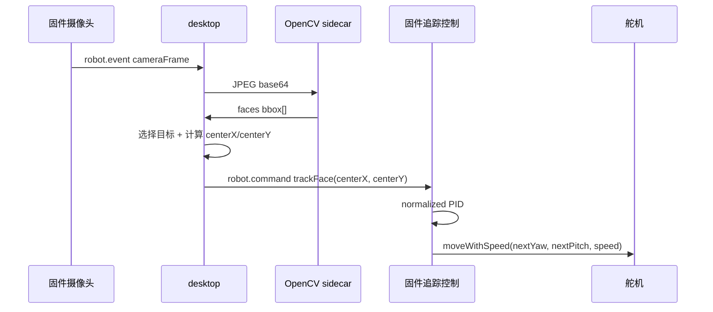

# 人脸追踪流程

本文档描述当前 OpenCV 人脸追踪链路：desktop 负责从摄像头帧中检测人脸并选择目标中心点，固件负责用归一化中心误差做 PID 增量控制并驱动舵机。

## 总览



## desktop 识别逻辑

1. 固件通过 `cameraFrame` 推送 JPEG 帧。
2. desktop 将帧传给 `desktop/scripts/face_detector.py`。
3. Python sidecar 使用 OpenCV Haar cascade：
   - `haarcascade_frontalface_default.xml`
   - `haarcascade_profileface.xml`
   - 水平翻转后的 profile 检测
4. sidecar 对重复框做 IoU 合并，输出归一化 `bbox`。
5. desktop 选择目标：优先面积大、靠近画面中心、且靠近上一帧目标的人脸。
6. 如果配置了 `STACKCHAN_FACE_TRACKING_MIRROR_X=true`，在下发前水平镜像目标。
7. desktop 直接计算并下发：

```ts
centerX = bbox.x + bbox.width / 2;
centerY = bbox.y + bbox.height / 2;
```

当前 OpenCV 方案不做 FOV 角度转换、不下发 landmarks/pose/expression、不做 alpha-beta 预测、不做 measurement-age stale gating、不做重捕获连续帧确认。

## trackFace 协议

WebSocket envelope 不变：

```ts
{
  type: "robot.command";
  seq?: number;
  commandId: string;
  command: RobotCommand;
}
```

`trackFace` payload：

```ts
type TrackFaceCommand = {
  kind: "trackFace";
  detected: boolean;
  centerX?: number;       // 0..1，detected=true 必填
  centerY?: number;       // 0..1，detected=true 必填
  bbox?: {
    x: number;
    y: number;
    width: number;
    height: number;
    confidence?: number;
  };
  confidence?: number;    // 0..1
  speed?: number;         // 0..1000
  control?: FaceTrackingControl;
  reason?: string;
};

type FaceTrackingControl = {
  mode: "pid";
  deadband: number;       // 0..0.3，归一化画面坐标
  yaw: { kp: number; ki: number; kd: number };
  pitch: { kp: number; ki: number; kd: number };
  integralLimit: number;  // 0..2
  outputLimitDeg: number; // 1..45
};
```

`detected=true` 时 `centerX`、`centerY` 必填。`detected=false` 可只带 `reason`、`speed`、`control`。

## 固件控制逻辑

固件保存最近一次 `trackFace`：

```text
centerX, centerY, confidence, speed, control, updatedAt
```

`AppLocalCompanion::sync_face_tracking()` 按固定间隔运行：

```text
errorX = centerX - 0.5
errorY = 0.5 - centerY

if abs(error) < deadband:
  error = 0

integral = clamp(integral + error * dt, -integralLimit, integralLimit)
derivative = (error - previousError) / dt

yawDeltaDeg =
  yaw.kp * errorX + yaw.ki * yawIntegral + yaw.kd * yawDerivative

pitchDeltaDeg =
  pitch.kp * errorY + pitch.ki * pitchIntegral + pitch.kd * pitchDerivative

delta = clamp(delta, -outputLimitDeg, outputLimitDeg)
nextServo = clamp(currentServo + delta * 10, fixedServoRange)
```

固件固定舵机范围：

| 轴 | 范围 |
| --- | --- |
| yaw | `-600..600` |
| pitch | `100..700` |

`detected=false` 时只重置 PID 状态并保留追踪 reservation 一小段时间，不立即强制回中。

## 默认参数

| 参数 | 默认值 |
| --- | --- |
| `STACKCHAN_FACE_TRACKING_SPEED` | `420` |
| `STACKCHAN_FACE_TRACKING_DEADBAND` | `0.045` |
| `STACKCHAN_FACE_TRACKING_YAW_KP` | `42` |
| `STACKCHAN_FACE_TRACKING_YAW_KI` | `0` |
| `STACKCHAN_FACE_TRACKING_YAW_KD` | `8` |
| `STACKCHAN_FACE_TRACKING_PITCH_KP` | `30` |
| `STACKCHAN_FACE_TRACKING_PITCH_KI` | `0` |
| `STACKCHAN_FACE_TRACKING_PITCH_KD` | `6` |
| `STACKCHAN_FACE_TRACKING_INTEGRAL_LIMIT` | `0.35` |
| `STACKCHAN_FACE_TRACKING_OUTPUT_LIMIT_DEG` | `20` |

## 日志

如果启用 `STACKCHAN_FACE_TRACKING_TRACE_LOG`，desktop 会写入 `logs/face-tracking.ndjson`。关键事件：

| event type | 含义 |
| --- | --- |
| `faceDetection` | 当前帧检测结果、目标框、目标中心 |
| `trackCommand` | 下发给固件的 `trackFace` 命令 |
| `trackCommandResult` | 命令发送结果 |

