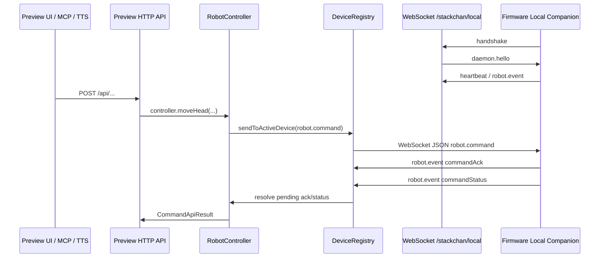

# StackChan 本地命令协议

本文档描述 desktop 如何向固件设备发送指令、WebSocket 协议 envelope、当前命令 schema，以及浏览器 HTTP API 到设备命令的映射。

相关源码：

- desktop 浏览器 API：`desktop/src/preview/server.ts`
- desktop 前端调用：`desktop/preview-ui/src/api/client.ts`
- desktop 命令调度：`desktop/src/robot/controller.ts`
- desktop 设备会话：`desktop/src/device/registry.ts`
- desktop WebSocket 服务：`desktop/src/ws/server.ts`
- 协议类型和 JSON Schema：`protocol/src/types.ts`、`protocol/src/schemas.ts`
- 固件 WebSocket/命令执行：`firmware/main/services/local_companion/local_companion_service.cpp`

## 总览

设备不是被 desktop 主动拨号连接；固件会主动连接 desktop daemon 的 WebSocket 服务。连接建立后，desktop 通过同一条 WebSocket 连接发送 `robot.command` JSON 消息。



## 连接协商

WebSocket 服务地址：

```text
ws://<desktop-host>:<desktop-port>/stackchan/local
```

连接第一帧必须是固件发出的 `handshake`：

```ts
type HandshakeMessage = {
  type: "handshake";
  deviceId: string;
  firmwareVersion: string;
  capabilities: DeviceCapability[];
  audioParams: {
    format: "opus";
    sampleRate: 16000 | 24000;
    channels: 1;
    frameDurationMs: 20 | 30 | 40 | 60;
  };
  pairingToken: string;
};
```

desktop 校验 `pairingToken` 和 schema 后，返回 `daemon.hello`：

```ts
type DaemonHelloMessage = {
  type: "daemon.hello";
  protocolVersion?: "1.1" | "1.2";
  sessionId: string;
  heartbeatIntervalMs: number;
  featureFlags: string[];
  featureParams?: {
    binaryCameraFrame?: { envelope: "SCL1"; cameraKind: 1 };
    mediaCredit?: { defaultCreditFrames: number; maxCreditFrames: number };
  };
  qosProfiles?: {
    robotCommand: "reliable";
    cameraFrame: "latestOnly";
    telemetry: "bestEffort";
    audio: "reliableChunked";
  };
  audioParams: HandshakeMessage["audioParams"];
};
```

当前 desktop 返回的主要 `featureFlags`：

```text
mcp, mockVoice, cameraSnapshot, cameraStream, faceTracking,
audioPlayback, rgbControl, sensorTelemetry, robotCommand,
binaryCameraFrame, adaptiveCameraStream, commandStatus,
mediaCredit, qosProfiles
```

## Envelope 类型

本地协议的顶层 envelope 由 `protocol/src/schemas.ts` 定义，`protocol/schemas/envelope.schema.json` 只是入口说明。

| type | 方向 | 用途 |
| --- | --- | --- |
| `handshake` | device -> desktop | 设备注册、能力上报、pairing token 校验 |
| `daemon.hello` | desktop -> device | 会话参数、心跳间隔、功能开关、QoS 声明 |
| `heartbeat` | device -> desktop | 在线状态保活 |
| `robot.command` | desktop -> device | 桌面端发给设备的指令 |
| `robot.event` | device -> desktop | 传感器、状态、命令 ack/status、图片等事件 |
| `error` | 双向 | 协议或执行错误 |

## 命令 Envelope

所有设备指令都包在 `robot.command` 里：

```ts
type RobotCommandMessage = {
  type: "robot.command";
  seq?: number;
  commandId: string;
  command: RobotCommand;
};
```

字段含义：

| 字段 | 含义 |
| --- | --- |
| `type` | 固定为 `robot.command` |
| `seq` | desktop 生成的命令序号，`RobotController` 每次递增 |
| `commandId` | desktop 生成的 UUID，用于匹配 ACK 和状态事件 |
| `command` | 实际命令对象，按 `command.kind` 区分 schema |

发送规则：

- desktop 选择 `DeviceRegistry.getActiveSession()` 返回的最新在线设备。
- 命令以 WebSocket 文本 JSON 发送；命令通道不使用二进制帧。
- 默认等待 `commandAck`，超时 1500 ms；`cameraStream` 默认 ACK 超时 5000 ms；音频分片默认 ACK 超时 2500 ms。
- 只有显式传 `waitForCompletion: true` 时 desktop 才等待 `commandStatus` 终态。
- `trackFace` 和 `mediaFlowControl` 默认不等 ACK；固件当前也不会为这两类命令回 ACK。

## RobotCommand 总表

当前 `RobotCommand` union 一共有 13 种命令：

| kind | 主要用途 | 常见入口 | 固件 ACK | 固件终态 |
| --- | --- | --- | --- | --- |
| `say` | 显示/播报文本 | MCP、`wakeWord` mock voice | `accepted` | `completed` |
| `react` | 表情、头像、RGB 闪烁 | Preview 表情、MCP、completion light | `accepted` | `completed` |
| `moveHead` | 头部 yaw/pitch 舵机控制 | Servo UI、MCP | `accepted` | `completed` |
| `cameraStream` | 开关设备相机流 | Raw Preview、Face Tracking | `accepted` | `completed` |
| `trackFace` | 发送人脸目标给固件追踪 | Face Tracking loop | 无 | 无 |
| `playAnimation` | 播放动作序列 | MCP | `accepted` | `started` |
| `playAudioStart` | 音频分片传输开始 | completion TTS | `accepted/rejected` | `completed/failed` |
| `playAudioChunk` | 音频分片数据 | completion TTS | `accepted/rejected` | `completed/failed` |
| `playAudioEnd` | 音频传输结束并开始播放 | completion TTS | `accepted/rejected` | `started/failed` |
| `captureImage` | 请求设备拍照 | Preview、MCP | `accepted/rejected` | `completed/failed` |
| `setMode` | 设置设备本地状态 | Codex watcher、TTS、MCP | `accepted` | `completed` |
| `setRgb` | 控制机身 RGB 常亮/关闭 | Preview RGB | `accepted` | `completed` |
| `mediaFlowControl` | 相机帧 credit 流控 | Vision Tracking | 无 | 无 |

通用约束：

- `protocol/src/schemas.ts` 对 `robot.command.command` 使用 `oneOf`，每个命令对象都 `additionalProperties: false`。
- `RobotController.dispatch()` 当前不在发送前执行 JSON Schema 校验；Preview HTTP、MCP zod schema、controller 代码和固件分支各自做一部分校验或 clamp。
- 固件侧没有通用 schema validator，主要按 `command.kind` 分支读取字段，缺字段时很多地方使用默认值。

## RobotCommand 明细

### say

用途：把一段文本交给设备侧文本展示/播报链路。

Schema：

```ts
type SayCommand = {
  kind: "say";
  text: string;       // required, schema minLength: 1
  interrupt?: boolean;
  voice?: string;
};
```

入口：

| 入口 | 代码路径 | 说明 |
| --- | --- | --- |
| MCP `stackchan_say` | `desktop/src/mcp/server.ts` | 传入 `text/interrupt/voice` |
| `wakeWord` mock voice | `desktop/src/ws/server.ts` | 设备发 `wakeWord` event 后，server 直接回 `say`，不经过 `RobotController`，也没有 `seq` |

desktop 行为：

- `RobotController.say()` 直接封装为 `robot.command`。
- 默认等待 ACK，默认不等待 completion。
- controller 日志只记录 `textLength`，不会把完整文本写入 command 日志。

固件行为：

- 读取 `command.text`，构造 `WsTextMessage_t { name: "Codex", content }`。
- 触发 `GetDeviceRuntime().onWsTextMessage.emit(message)`。
- 设备 app 收到后添加 `TimedSpeechModifier` 和 `SpeakingModifier`，用于屏幕上的说话状态/文字表现。
- 发送 `commandAck accepted`。
- 发送 `state { mode: "speaking", detail: "say command" }`。
- 发送 `commandStatus completed`，`message="text displayed"`，`progress=1.0`。

注意：

- 固件当前没有使用 `interrupt` 和 `voice` 字段。
- `wakeWord` mock voice 的直接回包路径不走 `DeviceRegistry.sendToActiveDevice()`，也不会进入 `RobotController` 的 ACK pending map。
- `SayCommand` 不传输音频数据。真正的音频播放走 `playAudioStart/playAudioChunk/playAudioEnd`，音频以 Ogg Opus base64 分片放在 `playAudioChunk.dataBase64` 中传输。

### react

用途：更新头像表情，或者把 avatar/RGB JSON 透传给设备侧显示和灯效逻辑。

Schema：

```ts
type ReactCommand = {
  kind: "react";
  emotion:
    | "neutral" | "happy" | "laughing" | "love" | "sad" | "crying"
    | "angry" | "thinking" | "surprised" | "sleepy" | "doubtful";
  durationMs?: number; // schema minimum: 1
  avatarJson?: Record<string, unknown>;
  rgbJson?: Record<string, unknown>;
};
```

入口：

| 入口 | 代码路径 | 说明 |
| --- | --- | --- |
| Preview `POST /api/expression` | `desktop/src/preview/server.ts` | 校验 emotion，`durationMs` clamp 到 `100..10000`，默认 2000 |
| MCP `stackchan_react` | `desktop/src/mcp/server.ts` | zod 校验 emotion，`durationMs` 为正整数 |
| completion light | `desktop/src/tts/completion-announcer.ts` | 用 `react` 发送短 RGB 闪烁，`waitForAck=false` |

desktop 行为：

- Preview 可传 `avatarJson`，但会先收敛成 `bleAvatar` 的 `leftEye/rightEye/mouth` 结构。
- Preview 的 `flash=true` 会生成 `rgbJson`：`leftRgbDuration/rightRgbDuration/leftRgbColor/rightRgbColor`。
- 默认等待 ACK；completion light 为了低延迟不等待 ACK。

固件行为：

- `durationMs` 缺省为 2000。
- `avatarJson` 和 `rgbJson` 如果存在，会序列化成字符串后放入 `WsReactMessage_t`。
- 触发 `GetDeviceRuntime().onWsReactMessage.emit(message)`。
- 返回 `commandAck accepted` 和 `commandStatus completed`，`message="reaction applied"`。

### setRgb

用途：控制机身 RGB 常亮或关闭。

Schema：

```ts
type SetRgbCommand = {
  kind: "setRgb";
  enabled: boolean;    // required
  color?: string;      // schema pattern: ^#[0-9a-fA-F]{6}$
  brightness?: number; // schema range: 0..1
};
```

入口：

| 入口 | 代码路径 | 说明 |
| --- | --- | --- |
| Preview `POST /api/rgb` | `desktop/src/preview/server.ts` | `enabled=true` 时必须有合法 `#RRGGBB`，颜色转大写 |

desktop 行为：

- `enabled=false` 时 Preview 仍会补 `color="#000000"`。
- `brightness` 必须是有限 number，Preview clamp 到 `0..1`。
- 默认等待 ACK，不等待 completion。

固件行为：

- `enabled=false` 时强制颜色为 `#000000`。
- `color` 不是 7 字符时回退为 `#000000`。
- 生成 neon light JSON：

```json
{
  "leftRgbDuration": 0.12,
  "rightRgbDuration": 0.12,
  "leftRgbColor": "#RRGGBB",
  "rightRgbColor": "#RRGGBB"
}
```

- 调用 `GetStackChan().updateNeonLightFromJson(...)`。
- 保存 `_rgb_control_enabled/_rgb_control_color/_rgb_control_brightness`。
- 返回 `commandAck accepted` 和 `commandStatus completed`，`message="rgb applied"`。

注意：当前 neon light JSON 只使用 `color`，`brightness` 主要被固件保存为状态值，没有直接参与当前颜色输出计算。

### moveHead

用途：控制头部 yaw/pitch 舵机目标位置。

Schema：

```ts
type MoveHeadCommand = {
  kind: "moveHead";
  yaw: number;    // required
  pitch: number;  // required
  speed?: number;
};
```

入口：

| 入口 | 代码路径 | 说明 |
| --- | --- | --- |
| Preview `POST /api/hardware/move-head` | `desktop/src/preview/server.ts` | `yaw -1800..1800`，`pitch -1200..1200`，`speed 0..1000` |
| Servo UI | `desktop/preview-ui/src/features/modules/ServoModule.tsx` | UI 常用 `yaw -1280..1280`，`pitch 0..900`，`speed=420` |
| MCP `stackchan_move_head` | `desktop/src/mcp/server.ts` | 当前 zod 仍是 `yaw -90..90`、`pitch -45..45` |

desktop 行为：

- `RobotController.moveHead()` 先占用 motion gate：owner=`manual`，hold=2500 ms。
- 发送 `trackFace { detected:false, reason:"manual moveHead command", speed:0 }` 暂停人脸追踪，且不等待 ACK。
- 再发送实际 `moveHead`，默认等待 ACK。

固件行为：

- 直接生成 motion JSON：

```json
{
  "yawServo": { "angle": 900, "speed": 420 },
  "pitchServo": { "angle": 0, "speed": 420 }
}
```

- 调用 `GetStackChan().updateMotionFromJson(...)`。
- 返回 `commandAck accepted` 和 `commandStatus completed`，`message="motion command applied"`。

注意：`protocol/src/schemas.ts` 当前仍写 `yaw -90..90`、`pitch -45..45`，这和 Servo UI、Preview HTTP、固件实际舵机值不一致。因为 outgoing command 没有统一 schema 校验，Preview 可以发送 `yaw=900` 这类实际舵机值。

### cameraStream

用途：开启或关闭设备相机 JPEG 流。

Schema：

```ts
type CameraStreamCommand = {
  kind: "cameraStream";
  enabled: boolean; // required
  fps?: number;     // schema 1..10
  width?: number;   // schema enum 320 | 640
  height?: number;  // schema enum 240 | 480
  quality?: number; // schema 1..100
  format?: "jpeg";
};
```

入口：

| 入口 | 代码路径 | 说明 |
| --- | --- | --- |
| Preview `POST /api/hardware/camera-stream` | `desktop/src/preview/server.ts` | 固定发送 `320x240 jpeg`，`fps 0..30`，`quality 1..63` |
| Preview `POST /api/raw-preview` | `desktop/src/preview/server.ts` | 更新 raw preview 设置，间接触发 `cameraStream` |
| Face Tracking | `desktop/src/vision/tracking.ts` | tracking 开启/关闭、相机参数变化、重试时自动发送 |

desktop 行为：

- `RobotController.cameraStream()` 会补 `format="jpeg"`。
- ACK timeout 使用 5000 ms。
- Vision Tracking 有两类 owner：`rawPreview` 和 `faceTracking`，只会为当前 owner 维持一个相机流。
- Raw Preview 默认 `320x240`、`fps=15`、`quality=14`。
- 如果设备有 `mediaCredit` capability，camera stream 开启后会配合 `mediaFlowControl` 控制在途帧数。

固件行为：

- `apply_camera_stream_command()` 读取 `enabled/fps/width/height/quality`。
- `fps` clamp 到 `1..15`。
- 当前只支持 `320x240`，请求其它分辨率会记录 `fallbackReason="unsupported_resolution"`，实际仍使用 `320x240`。
- `quality` clamp 到 `1..100`。
- 开启 camera stream 时，如果之前未开启，会让 face tracking target 进入 reserved hold，默认速度至少 420，hold 3500 ms。
- 返回 `commandAck accepted` 和 `commandStatus completed`，`message="camera stream configured"`。

输出事件：

- 支持 `binaryCameraFrame` 时优先发二进制 `SCL1` camera frame。
- 否则发 JSON `robot.event { kind:"cameraFrame" }`。

### trackFace

用途：把 desktop 检测到的人脸中心点和 PID 控制参数发送给固件，固件侧根据归一化中心误差驱动舵机追踪。

Schema：

```ts
type TrackFaceCommand = {
  kind: "trackFace";
  detected: boolean;
  centerX?: number;        // 0..1, detected=true required
  centerY?: number;        // 0..1, detected=true required
  bbox?: {
    x: number;
    y: number;
    width: number;
    height: number;
    confidence?: number;
  };
  confidence?: number;     // 0..1
  speed?: number;          // 0..1000
  control?: FaceTrackingControl;
  reason?: string;
};
```

`control` schema：

```ts
type FaceTrackingControl = {
  mode: "pid";
  deadband: number;             // 0..0.3
  yaw: { kp: number; ki: number; kd: number };
  pitch: { kp: number; ki: number; kd: number };
  integralLimit: number;        // 0..2
  outputLimitDeg: number;       // 1..45
};
```

入口：

| 入口 | 代码路径 | 说明 |
| --- | --- | --- |
| Face Tracking loop | `desktop/src/vision/tracking.ts` | 最多 `commandMaxHz=15`，按最小发送间隔节流 |
| Tracking disabled/lost | `desktop/src/vision/tracking.ts` | 发送 `detected=false` |
| `moveHead/playAnimation/playAudio` 前置暂停 | `desktop/src/robot/controller.ts` | 自动发送 `detected=false`，释放追踪控制 |

desktop 行为：

- 默认 `waitForAck=false`。
- motion gate 会阻止 face tracking 覆盖手动移动、动画、音频等动作。
- `detected=true` 时会 reserve owner=`faceTracking`，hold=900 ms。
- OpenCV detector 输出 bbox，desktop 选择目标后直接下发 `centerX/centerY`。
- 当前协议不下发 landmarks、pose、expression、角度误差或 measurement age。

固件行为：

- 不返回 ACK/Status。
- `speed` clamp 到 `0..1000`，默认 420。
- 更新 `_face_tracking_target.control`。
- `detected=false` 时设置 target 为未检测到，进入 reserved 状态并设置 hold 3500 ms。
- `detected=true` 时要求 `centerX`、`centerY`，并将中心点 clamp 到 `0..1`。

字段使用情况：

| 字段 | 当前是否有用 | 使用位置 |
| --- | --- | --- |
| `detected` | 有用 | desktop/固件都用；决定是否追踪或进入 lost |
| `centerX`、`centerY` | 有用 | 固件 PID 输入，归一化视觉误差来源 |
| `bbox` | 有用 | 调试和日志，描述 detector 输出框 |
| `confidence` | 有用 | 调试和日志，描述 detector 置信度 |
| `speed` | 有用 | 固件舵机移动速度，clamp 到 `0..1000` |
| `control` | 有用 | 固件 PID 参数 |
| `reason` | 有用 | desktop/日志用来说明暂停或丢脸原因 |

PID 位置：

- desktop 负责相机帧接收、OpenCV 人脸检测、目标选择和中心点下发。
- 固件负责追踪控制和舵机执行，具体在 `AppLocalCompanion::sync_face_tracking()`：用 `centerX/centerY` 转成归一化误差，做 P/I/D、积分限幅和输出限幅，再调用 `motion.moveWithSpeed(...)`。
- PID 参数放进命令里，是为了让 desktop 的 tracking 设置实时调固件控制行为。

### playAnimation

用途：把动作序列发送给设备侧动作播放逻辑。

Schema：

```ts
type PlayAnimationCommand = {
  kind: "playAnimation";
  sequence: unknown[]; // required
  loop?: boolean;
};
```

入口：

| 入口 | 代码路径 | 说明 |
| --- | --- | --- |
| MCP `stackchan_play_animation` | `desktop/src/mcp/server.ts` | 传入任意 JSON array sequence |

desktop 行为：

- `RobotController.playAnimation()` 会占用 motion gate。
- `loop=true` 时 hold=60000 ms，否则 hold=10000 ms。
- 发送前会暂停 face tracking。
- 默认等待 ACK。

固件行为：

- 把 `command.sequence` 序列化为 JSON 字符串。
- 触发 `GetDeviceRuntime().onWsDanceData.emit(sequence_json)`。
- 返回 `commandAck accepted`。
- 返回 `commandStatus started`，`message="animation started"`，`progress=0.0`。

注意：当前没有动画结束时的 `commandStatus completed`，所以调用端不应等待 animation completion。

### playAudioStart

用途：打开一次 Ogg Opus 音频分片传输。

Schema：

```ts
type PlayAudioStartCommand = {
  kind: "playAudioStart";
  requestId: string;       // required, minLength: 1
  format: "ogg_opus";      // required
  mimeType: "audio/ogg";   // required
  sampleRate: 16000 | 24000;
  totalBytes: number;      // integer 1..262144
  totalChunks: number;     // integer 1..128
  text?: string;
  interrupt?: boolean;
  volume?: number;         // integer 0..100
};
```

入口：

| 入口 | 代码路径 | 说明 |
| --- | --- | --- |
| completion TTS | `desktop/src/tts/completion-announcer.ts` | 合成音频后调用 `RobotController.playAudio()` |

desktop 行为：

- `RobotController.playAudio()` 生成或复用 `requestId`。
- 先把传入的 base64 解码为 Buffer。
- 空音频直接抛错；超过 262144 bytes 直接抛错。
- 每片最多 4096 bytes 原始音频。
- 发送 `playAudioStart` 后等待 ACK，ACK timeout=2500 ms。
- 如果 Start 未 accepted，释放 audio motion gate 并停止后续分片。

固件行为：

- 校验 `requestId` 非空，`format=="ogg_opus"`。
- 校验 `totalBytes` 和 `totalChunks` 在固件限制内。
- 初始化 `_audio_transfer`，保存 `requestId/text/totalBytes/totalChunks/volume`。
- 返回 `commandAck accepted` 和 `commandStatus completed`，`message="audio transfer opened"`。
- 校验失败时返回 `commandAck rejected`、`commandStatus failed`，并发送 `error { code:"invalid_audio_command" }`。

注意：

- `interrupt` 字段当前 desktop 会传，固件 Start 分支没有使用。
- `mimeType` 和 `sampleRate` 在 schema 里受约束，固件当前主要校验 `format`、大小和分片数。

### playAudioChunk

用途：传输一次音频数据分片。

Schema：

```ts
type PlayAudioChunkCommand = {
  kind: "playAudioChunk";
  requestId: string;  // required, minLength: 1
  chunkIndex: number; // integer 0..127
  dataBase64: string; // minLength: 1, maxLength: 8192
};
```

desktop 行为：

- 每个 chunk 都是独立 `robot.command`，有自己的 `commandId`。
- `chunkIndex` 从 0 开始递增。
- 每片等待 ACK，ACK timeout=2500 ms。
- 任一分片未 accepted 就停止传输并释放 audio motion gate。

固件行为：

- 要求已有 active transfer，且 `requestId` 匹配。
- 要求 `chunkIndex == nextChunkIndex`，不允许跳片或乱序。
- 要求 `dataBase64` 非空且不超过固件 `kMaxAudioChunkBase64Bytes`。
- base64 解码失败会 rejected。
- 累计 decoded bytes 不能超过 `totalBytes`。
- 成功后追加数据，`nextChunkIndex++`。
- 返回 `commandAck accepted` 和 `commandStatus completed`，`message="audio chunk accepted"`。

### playAudioEnd

用途：结束音频传输，并让固件开始播放。

Schema：

```ts
type PlayAudioEndCommand = {
  kind: "playAudioEnd";
  requestId: string; // required, minLength: 1
};
```

desktop 行为：

- 所有 chunk accepted 后发送。
- 等待 ACK，ACK timeout=2500 ms。
- 返回的是 End 这条命令的结果，不代表音频已经播放完成。

固件行为：

- 要求 active transfer 且 `requestId` 匹配。
- 校验 `nextChunkIndex == totalChunks` 且累计 bytes 等于 `totalBytes`。
- 如果 Start 时带了 `text`，播放前会触发 `onWsTextMessage` 显示文本。
- 返回 `commandAck accepted`。
- 发送 `state { mode:"speaking", detail:"playAudio command" }`。
- 发送 `robot.event playback { state:"started" }`。
- 发送 `commandStatus started`，`message="playback started"`。
- 启动播放任务，播放完成后发送 `robot.event playback { state:"finished" }`；启动失败则发送 `playback failed`。

注意：`playAudioEnd` 没有 `commandStatus completed`；播放完成要监听 `playback` event。

### captureImage

用途：请求设备捕获一张 JPEG 图片。

Schema：

```ts
type CaptureImageCommand = {
  kind: "captureImage";
  requestId: string; // required, minLength: 1
  format?: "jpeg";
};
```

入口：

| 入口 | 代码路径 | 说明 |
| --- | --- | --- |
| Preview `POST /api/hardware/capture-image` | `desktop/src/preview/server.ts` | `requestId` 由 controller 默认生成 |
| MCP `stackchan_capture_image` | `desktop/src/mcp/server.ts` | 可传入 requestId |

desktop 行为：

- `RobotController.captureImage()` 默认生成 UUID requestId，并补 `format="jpeg"`。
- Preview 默认等待 ACK，不等待 completion。

固件行为：

- 调用拍照逻辑。
- 成功时发送：

```ts
type ImageEvent = {
  kind: "image";
  requestId: string;
  mimeType: "image/jpeg";
  dataBase64: string;
};
```

- 成功返回 `commandAck accepted` 和 `commandStatus completed`，`message="image captured"`。
- 失败返回 `commandAck rejected` 和 `commandStatus failed`，`message="capture failed"`，并发送可恢复 `error`。

### setMode

用途：设置固件侧本地状态机，用于表达连接中、思考中、说话中、错误等 UI/状态。

Schema：

```ts
type SetModeCommand = {
  kind: "setMode";
  mode: "idle" | "connecting" | "listening" | "thinking" | "speaking" | "pairing" | "sleeping" | "error";
  reason?: string;
};
```

入口：

| 入口 | 代码路径 | 说明 |
| --- | --- | --- |
| MCP `stackchan_set_mode` | `desktop/src/mcp/server.ts` | 手动设置 mode |
| Codex session watcher | `desktop/src/codex/session-watcher.ts` | 根据 Codex 状态自动设置 |
| completion TTS | `desktop/src/tts/completion-announcer.ts` | 播放完成、超时或失败后设置 `idle` |

desktop 行为：

- 默认等待 ACK。
- session watcher 如果发送失败会重试 pending mode change。

固件行为：

- `mode_from_string()` 转换为 `_local_state`。
- 返回 `commandAck accepted`。
- 发送 `state` event：`mode` 为请求值，`detail` 为 `reason` 或 `"setMode command"`。
- 返回 `commandStatus completed`，`message="mode applied"`。

### mediaFlowControl

用途：桌面端给固件相机流授予发送 credit，避免相机帧堆积。

Schema：

```ts
type MediaFlowControlCommand = {
  kind: "mediaFlowControl";
  stream: "camera";
  creditFrames: number; // schema integer 0..120
  maxInFlight?: number; // schema integer 1..120
  reason?: string;
};
```

入口：

| 入口 | 代码路径 | 说明 |
| --- | --- | --- |
| Vision Tracking | `desktop/src/vision/tracking.ts` | camera stream active、detector ready、raw preview ready 时发 credit |

desktop 行为：

- 只有 active session capability 包含 `mediaCredit` 时发送。
- 当前 raw preview 和 face tracking 都使用 `maxInFlight=1`。
- 每次通常只 grant 1 frame。
- 默认 `waitForAck=false`。

固件行为：

- 不返回 ACK/Status。
- 只接受 `stream=="camera"`，其它 stream 直接忽略。
- `creditFrames` clamp 到 `0..kMaxCameraCreditFrames`。
- `maxInFlight` clamp 到 `1..kMaxCameraCreditFrames`。
- 实际 credit 是累加后再 clamp 到 `_camera_max_in_flight`。

注意：协议 schema 允许 `creditFrames/maxInFlight` 到 120，但当前固件还会按自己的 `kMaxCameraCreditFrames` 再 clamp，目前实现侧实际最大为 12。

## ACK、状态和错误

命令 ACK 是普通 `robot.event`：

```ts
type CommandAckEvent = {
  kind: "commandAck";
  commandId: string;
  commandKind: RobotCommand["kind"] | "unknown";
  requestId?: string;
  status: "accepted" | "rejected";
  message?: string;
};
```

命令状态也是 `robot.event`：

```ts
type CommandStatusEvent = {
  kind: "commandStatus";
  commandId: string;
  commandKind: RobotCommand["kind"] | "unknown";
  requestId?: string;
  status: "started" | "completed" | "failed" | "cancelled";
  message?: string;
  progress?: number; // 0..1
};
```

错误 envelope：

```ts
type ErrorMessage = {
  type: "error";
  code: string;
  message: string;
  recoverable: boolean;
  commandId?: string;
};
```

desktop `RobotController` 用 `commandId` 匹配 pending ACK/Status。`commandKind` 由固件白名单归一化，未知命令会变成 `unknown`。

## 浏览器 HTTP API 到设备命令映射

Preview UI 不能直接访问设备 WebSocket，它只请求本地 Preview HTTP API。

| HTTP API | HTTP body | 转成的 `command.kind` | 备注 |
| --- | --- | --- | --- |
| `POST /api/rgb` | `{ enabled, color?, brightness? }` | `setRgb` | `enabled=true` 时 `color` 必须是 `#RRGGBB` |
| `POST /api/expression` | `{ emotion, durationMs?, flash?, rgbColor?, avatarJson? }` | `react` | `flash=true` 会生成 `rgbJson` |
| `POST /api/hardware/move-head` | `{ yaw, pitch, speed? }` | `moveHead` | preview sanitize 范围见上文 |
| `POST /api/hardware/camera-stream` | `{ enabled, fps?, width?, height?, quality? }` | `cameraStream` | preview 实际固定 320x240 JPEG |
| `POST /api/hardware/capture-image` | `{}` | `captureImage` | `requestId` 由 controller 生成 |
| `POST /api/tracking` | `{ enabled?, control? }` | 间接 `cameraStream`、`trackFace` | 这是 desktop vision 控制，不是直接设备协议 |
| `POST /api/raw-preview` | `{ enabled, fps?, width?, height?, quality? }` | 间接 `cameraStream` | 控制 desktop raw preview 状态 |

HTTP 返回统一形态：

```ts
type CommandApiResult = {
  ok: boolean;
  sent?: boolean;
  reason?: string;
  error?: string;
  ack?: unknown;
  completion?: unknown;
  command?: unknown;
  motion?: unknown;
};
```

`ok` 的计算规则：

```ts
ok = result.sent && (!result.ack || result.ack.status === "accepted")
```

## 其它入口

除了 Preview UI，还有这些入口会走同一个 `RobotController`：

- MCP tools：`desktop/src/mcp/server.ts`
- face tracking：`desktop/src/vision/tracking.ts`
- completion TTS：`desktop/src/tts/completion-announcer.ts`
- Codex session watcher：`desktop/src/codex/session-watcher.ts`

因此最终发到设备的都是同一类 `robot.command` envelope。

## 当前注意点

1. `protocol/src/schemas.ts` 是协议 schema 的源码真相，但 `RobotController.dispatch()` 当前没有对 outgoing `robot.command` 做 runtime JSON Schema 校验。
2. 固件侧也没有通用 schema 校验，主要依赖 `command.kind` 分支解析和局部 clamp。
3. `moveHead` 的 schema 范围和当前 Servo UI/固件实际单位不一致。
4. `trackFace`、`mediaFlowControl` 当前设计为高频/流控命令，不回 ACK；调用端必须用 `waitForAck=false`。
5. `playAnimation` 和 `playAudioEnd` 会返回 `started`，但完成语义分别依赖动作系统或 `playback` event，不应直接等待 `commandStatus completed`。
